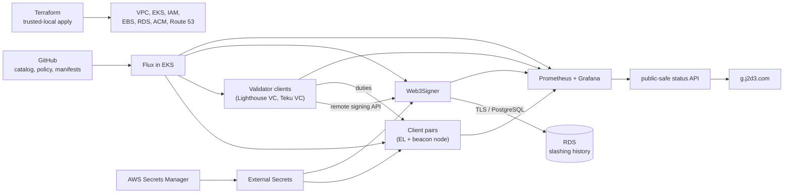

# Ethereum Validator Platform Lab

An Ethereum validator platform lab for running heterogeneous execution and
consensus client pairs on Amazon EKS, qualifying them through live testnet
synchronization, and promoting selected pairs into Web3Signer-backed signing
validators through reviewed GitOps changes.

The repository is also a documented experiment in using two AI coding agents as
independent builder and reviewer lanes, with the human operator retaining the
identity, deposit, infrastructure, and security-sensitive gates.

**Live portal**: [`https://g.j2d3.com`](https://g.j2d3.com) ·
**Latest signing evidence**:
[first Web3Signer-backed attestation](docs/evidence/2026-08-04-first-signing-validator.md) ·
**Specification**: [PRD](docs/prd/001-dynamic-validator-platform.md) ·
**Full documentation index**: [`docs/README.md`](docs/README.md)

## Why this exists

Running one validator is a weekend project. Running a fleet on behalf of
customers is a key-custody problem wearing an infrastructure costume — the
hard parts are signing-key handling, slashing protection, and proving that a
machine which *looks* healthy is actually authorized to sign.

The scope of custody here is narrower than it sounds. The platform holds
encrypted **signing** keystores. Withdrawal credentials stay in offline operator
custody and are never imported (PRD §10.2). The platform cannot move customer
funds — but it can get a customer slashed. Controls are custody-grade because
the consequences are.

## What this demonstrates

- Terraform-owned AWS foundation (VPC, EKS, IAM, RDS, Secrets Manager, ACM,
  Route 53) separate from Flux-owned in-cluster application state.
- Flux GitOps reconciling controllers → infrastructure → signer prerequisites →
  observability → applications → node workloads.
- A single chart adapter serving five heterogeneous client pairs across three
  execution clients (Geth, Reth, Erigon) and two consensus clients (Lighthouse,
  Teku).
- Remote signing through Web3Signer with RDS-backed slashing protection as the
  single durable authority; validator clients (both Lighthouse VC and Teku VC)
  hold no private keys.
- End-to-end signing lifecycle **configured** for multiple distinct
  testnet validators on disjoint keys, each with a distinct on-chain 32
  tETH deposit; the observed active count and runtime state are reported
  live on the [portal](https://g.j2d3.com) rather than pinned here, so
  the README doesn't stale as new validators come online.
- A public reader path (portal + status API + Grafana) that exposes aggregate
  telemetry without leaking customer, validator, key, Pod, node, or AWS
  identifiers.

## Current client-pair matrix

| Execution | Consensus | State | Distinct role in the matrix |
|---|---|---|---|
| Geth | Lighthouse | Signing (validator #1) | Baseline vertical slice; first complete signing-duty path |
| Reth | Lighthouse | Signing (validator #2) | Changes only the EL; proves Reth-specific telemetry |
| Geth | Teku | Signing (validator #3) | Changes only the CL; first non-Lighthouse VC |
| Reth | Teku | Signing (validator #4) | Completes the original 2×2; adapter composition confirmed under duty |
| Erigon | Lighthouse | Non-signing | Third EL implementation strategy (staged sync); qualifies embedded consensus interaction |

Each pair has a dedicated profile at [`docs/client-pairs/`](docs/client-pairs/).

## Architecture at one glance



More detail: [`docs/architecture/system-overview.md`](docs/architecture/system-overview.md).

## Signing and custody boundary

- **In-repo**: public validator identifiers, fee recipients, image digests,
  chain configuration, IAM policy, Flux manifests, Kubernetes objects.
- **In AWS Secrets Manager**: encrypted EIP-2335 keystores and their passwords,
  one identity-addressed container per validator. Terraform declares the
  containers; only the trusted-workstation onboarding tool ever writes into
  them.
- **In RDS**: Web3Signer's slashing-protection database, authoritative and
  durable across validator-client restarts.
- **Never present anywhere the platform can reach**: withdrawal mnemonics,
  withdrawal private keys, unencrypted validator private keys.

Two independent layers enforce non-signing until the last review is complete:
a chart-level `signingQualified` schema gate and a projection-tool refusal for
synthetic identities. See
[`docs/architecture/safety-and-custody-boundaries.md`](docs/architecture/safety-and-custody-boundaries.md).

## From pair to duty: the production pipeline

```text
Client pair selected
  → Chart adapter implemented and cross-reviewed
  → Catalog + assignment added as non-signing
  → Flux reconciles the non-signing pair on EKS
  → Live sync qualified against the network
  → Human generates a distinct identity and deposits 32 tETH
  → Operator onboards the encrypted keystore into AWS Secrets Manager
  → Web3Signer projection extended and reconciled
  → Beacon recognizes the deposited key as pending_initialized
  → Assignment flipped to signingEnabled with distinct validator identity
  → Validator client runs doppelganger detection
  → First attributable attestation observed and recorded as evidence
```

The pipeline is manually gated at the identity + deposit ceremony (the operator
alone) and enforced by CI + chart schemas at every other transition.

## What this is not

- **Not a production staking service.** RDS is Single-AZ, Web3Signer runs one
  replica, no disaster-recovery drills have been executed, and the cluster is
  sized for a lab.
- **Not a security guarantee.** Anonymous Grafana Viewer access is enabled for
  the demo; it can issue arbitrary PromQL against the cluster datasource.
  Nothing under that datasource is secret in a testnet lab, but the
  configuration is deliberately not appropriate for production.
- **Not a source of runtime evidence you can trust from documentation alone.**
  All observed values live in
  [`docs/evidence/`](docs/evidence/); the README's "state" table is a
  point-in-time summary that can drift within hours.

## Documentation map

Full index at [`docs/README.md`](docs/README.md). The one-line summary:

| Category | Location | Purpose |
|---|---|---|
| Architecture | [`docs/architecture/`](docs/architecture/) | How the whole system fits together and where trust boundaries sit |
| Components | [`docs/components/`](docs/components/) | Per-subsystem contract, implementation, and failure modes |
| Client pairs | [`docs/client-pairs/`](docs/client-pairs/) | Per-pair "why it matters" profiles |
| Runbooks | [`docs/runbooks/`](docs/runbooks/) | Operator procedures |
| Evidence | [`docs/evidence/`](docs/evidence/) | Sanitized observations at a specific commit and time |
| PRD | [`docs/prd/`](docs/prd/) | Product requirements and durable architecture contract |
| ADRs | [`docs/adrs/`](docs/adrs/) | Accepted architecture decisions |
| Agentic workflow | [`docs/development/agentic-workflow.md`](docs/development/agentic-workflow.md) | How the two-agent build model works |

## Repository map

| Path | Purpose |
|---|---|
| `applications/` | Customers, service profiles, network profiles, validator identities, and assignments (the source-of-truth catalog) |
| `schemas/` and `tools/` | Catalog JSON Schemas, relational validation, projection, and lifecycle tooling |
| `charts/ethereum-node/` | Client-pair Helm chart with per-EL and per-CL adapter dispatch |
| `clusters/local`, `clusters/dev` | Flux reconciliation entry points |
| `platform/infrastructure/` | Controllers and environment-specific infrastructure adapters |
| `platform/apps/` | Web3Signer, schema migration, observability, portal API, node pair composition |
| `terraform/` | Trusted-local AWS foundation (VPC, EKS, IAM, RDS, Secrets Manager, ACM, Route 53) |
| `control-plane/portal/` | Public project portal (Next.js on Cloudflare Sites) |
| `docs/` | Specifications, decisions, runbooks, client-pair profiles, and runtime evidence |
| `hack/` | Operator scripts (onboarding, merge wrapper, local dev helpers) |

## Run the local profile

The local `kind` profile is useful for chart and Kubernetes-contract
development without AWS cost. It does not reproduce EKS, IAM, EBS, RDS, VPC, or
Network Load Balancer behavior. See
[`docs/runbooks/local-development.md`](docs/runbooks/local-development.md) and
run:

```bash
make tools
make check
make local-up
make local-seed
make local-status
```

Run `make check` before opening a pull request.
