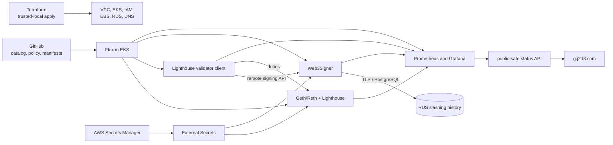

# Ethereum Validator Platform Lab

Terraform- and Flux-managed Ethereum validator infrastructure on Amazon EKS.
The repository covers client-pair deployment, remote signing through
Web3Signer, PostgreSQL slashing protection, lifecycle changes, and
observability. It is a testnet lab, not a production staking service.

[Live project portal](https://g.j2d3.com) ·
[First signing evidence](docs/evidence/2026-08-04-first-signing-validator.md) ·
[Architecture specification](docs/prd/001-dynamic-validator-platform.md) ·
[EKS bootstrap runbook](docs/runbooks/eks-flux-bootstrap.md)

## Current state

This is the observed state on 2026-08-04 at repository revision `e102fe2`.
The live portal reports the current public-safe cluster snapshot; this table is
the evidence checkpoint captured when the first validator began duties.

| Area | Observed state |
|---|---|
| Repository | Public for demonstration; runtime secrets and private key material are excluded from Git |
| AWS | One EKS 1.35 cluster in `us-west-2`; two on-demand system nodes and two Spot Ethereum workers were Ready across separate Availability Zones |
| GitOps | Eight Flux Kustomizations Ready on the same `main` revision; Flux owns in-cluster application state |
| Client pairs | Geth + Lighthouse and Reth + Lighthouse active on pinned Ephemery generation 162; both had non-zero peers, advancing execution and consensus heads, and zero consensus slot lag |
| Validator | One deposited 32 ETH testnet validator, index `30201`, `active_ongoing`; first unaggregated attestation published at slot `33927` |
| Signing | One encrypted EIP-2335 signing key projected from AWS Secrets Manager into Web3Signer; Lighthouse holds no private key |
| Slashing protection | Web3Signer 26.4.2 uses private, encrypted RDS PostgreSQL 18.3; the first duty produced two permitted checks, zero prevented signings, and one recorded attestation operation |
| Observability | Prometheus-backed public status adapter, Grafana, cluster and client-sync views, and the public project portal are live over HTTPS |

The validator remains running. Its first duty and the related negative evidence
are recorded in
[`docs/evidence/2026-08-04-first-signing-validator.md`](docs/evidence/2026-08-04-first-signing-validator.md).

## What this demonstrates

- Terraform can create the AWS foundation without owning application desired
  state.
- Flux can reconcile the EKS controllers, infrastructure adapters, signer
  prerequisites, observability services, client pairs, and validator client
  from reviewed Git state.
- Geth, Reth, and Lighthouse can use one generation-pinned Ephemery profile
  while retaining client-specific commands and metrics.
- A Lighthouse validator client can retrieve one public identity from
  Web3Signer, complete doppelganger detection, receive duties, and publish an
  attestation without mounting the signing key.
- Web3Signer can decrypt the EIP-2335 keystore, apply RDS-backed slashing
  checks, and sign the duty.
- The public portal can read a fixed, public-safe Prometheus view without
  exposing PromQL, Kubernetes object names, validator keys, customer records,
  credentials, or cloud identifiers.

## What remains unqualified

- RDS is Single-AZ. Multi-AZ failover, point-in-time restore, slashing-history
  export/import, and conflicting-signature rejection drills remain open.
- One successful attestation does not establish long-term validator
  effectiveness, proposal performance, or mainnet readiness.
- Safe stop, reactivation, archive, and client migration for the deposited
  identity have not completed the full lifecycle qualification.
- Reth + Lighthouse is non-signing. Teku support is implemented at the chart
  adapter layer but has not yet completed a live pair qualification.
- The target four-by-four client matrix is not complete.
- The current cluster, signer, database, ingress, and observability topology is
  sized for a short-lived lab, not a production validator fleet.

## Runtime architecture



The source repository is public so the project can be reviewed without an
invitation. A real validator operations repository would normally be private,
with narrowly scoped read access for Flux. Public visibility does not change
the rule that Git contains policy and public identifiers only; signing material
and passwords remain in the environment secret source.

## Control boundaries

Amazon EKS is the only cloud Kubernetes target in this repository. The local
`kind` profile is a development adapter; there is no GKE Terraform root.

| Writer | Owns | Does not own |
|---|---|---|
| Terraform, applied from a trusted workstation | VPC, EKS, managed node groups, IAM and Pod Identity, RDS, AWS secret containers, EBS prerequisites, ACM, and Route 53 | Helm releases, validator assignments, client lifecycle, or dashboards |
| GitHub Actions | CI validation and reviewed catalog or application change requests | AWS apply/destroy and direct Kubernetes changes |
| Flux | Continuous reconciliation of the EKS controllers, platform services, client pairs, policies, and dashboards from `main` | VPC, EKS, RDS, IAM, or account-level AWS resources |
| Operator | Key generation, testnet deposit, trusted-local Terraform, guarded emergency action, and final authority | Routine in-cluster reconciliation after bootstrap |

Important runtime rules are enforced in more than one place:

- schema and relational validation reject conflicting live assignments and
  signing without the required catalog state;
- the chart renders validator duties only for an active, signing-enabled
  assignment;
- Flux orders signer infrastructure, schema migration, Web3Signer, client
  pairs, and the validator application;
- the validator runs doppelganger detection before duties;
- Web3Signer is the signing endpoint and RDS is the durable slashing authority;
  and
- withdrawal private keys and mnemonics are never imported into the platform.

## Run the local profile

The local `kind` profile remains useful for application and Kubernetes contract
development without AWS cost. It does not reproduce EKS, IAM, EBS, RDS, VPC,
or Network Load Balancer behavior.

Read the [local development runbook](docs/runbooks/local-development.md), then:

```bash
make tools
make local-preflight
make local-up
make local-bootstrap
make local-seed
make local-status
```

Run `make check` before opening a pull request. Local secret material is read
only from Git-ignored paths. The default local profile starts no funded
validator duties.

## Documentation

| Document | Purpose |
|---|---|
| [Architecture specification](docs/prd/001-dynamic-validator-platform.md) | Product scope, domain model, safety invariants, target architecture, phases, and acceptance criteria |
| [First signing evidence](docs/evidence/2026-08-04-first-signing-validator.md) | Sanitized observations from the first active Web3Signer-backed validator duty |
| [Evidence index](docs/evidence/README.md) | Rules and index for public runtime-evidence records |
| [EKS Flux bootstrap](docs/runbooks/eks-flux-bootstrap.md) | Trusted bootstrap, AWS adapters, signer prerequisites, and reconciliation order |
| [EKS Ephemery qualification](docs/runbooks/eks-ephemery-sync.md) | Chain identity, client sync, recovery, and the historical node-only activation sequence |
| [Network profiles](docs/runbooks/network-profiles.md) | Immutable testnet generations, client adapters, signer binding, and rollover |
| [EKS capacity](docs/runbooks/eks-capacity.md) | Inspect, pause, and resume zonal Ethereum workers without changing application lifecycle |
| [Portal telemetry](docs/runbooks/portal-telemetry.md) | Public-safe status API contract and qualification |
| [Operations ingress](docs/runbooks/operations-ingress.md) | Exact-host HTTPS, Grafana, status API, ACM, NLB, and Route 53 operations |
| [Development environment](terraform/environments/dev/README.md) | Terraform ownership, applied AWS inventory, cost controls, and remaining production gaps |
| [Production evolution](docs/production-evolution.md) | Differences between local development, the current AWS lab, and a production design |
| [ADRs](docs/adrs/) | Accepted architecture decisions and tradeoffs |
| [Collaboration](COLLABORATION.md) | Human, Claude Code, and Codex branch, review, and merge workflow |
| [Contributing](CONTRIBUTING.md) | Pull-request requirements |
| [Security](SECURITY.md) | Reporting and handling expectations |

## Repository map

| Path | Purpose |
|---|---|
| `applications` | Customers, service profiles, network profiles, validator identities, and assignments |
| `schemas` and `tools` | Catalog schemas, relational validation, projection, and lifecycle tooling |
| `charts/ethereum-node` | Execution, beacon, and validator-client adapters |
| `clusters/local`, `clusters/dev` | Flux reconciliation entry points |
| `platform/infrastructure` | Controllers and environment-specific infrastructure adapters |
| `platform/apps` | Web3Signer, schema migration, observability, portal API, and node composition |
| `terraform` | Trusted-local AWS foundation and DNS roots |
| `control-plane/portal` | Public project portal |
| `docs` | Specifications, decisions, runbooks, and runtime evidence |

## Development workflow

The repository is maintained by the human operator with Claude Code and OpenAI
Codex. Work is claimed on the coordination issue, implemented on separate
branches, and cross-reviewed by the other agent. Authors merge through
`hack/merge-pr.sh`, which verifies the paired review applies to the exact head
and that required CI checks passed. The complete workflow is documented in
[COLLABORATION.md](COLLABORATION.md).

## Roadmap

| Workstream | State |
|---|---|
| Local GitOps and platform services | Implemented; local recovery and logging exercises remain useful |
| AWS foundation and EKS adapters | Applied and operating; production HA and recovery properties remain unqualified |
| First signing vertical slice | Active validator and first attestation observed; stop/reactivate/archive and restore drills remain |
| Client diversity | Geth + Lighthouse and Reth + Lighthouse live; Teku adapter implemented; additional pairs remain |
| Observability and portal | Public portal and status API live; validator/signing dashboard coverage is expanding |
| Customer Service control plane | Declarative catalog and workflow forms exist; authenticated CRUD portal is not implemented |
| Scale and production design | Design documented; load, cell, HA, and disaster-recovery exercises remain |

## Secret and custody boundary

No mnemonic, withdrawal private key, unencrypted validator key, keystore
password, AWS credential, or plaintext secret belongs in Git, Terraform state,
container images, workflow logs, or ordinary application manifests. The
platform holds an encrypted testnet signing keystore in AWS Secrets Manager and
projects it only into Web3Signer. The withdrawal address remains outside the
platform's custody; its corresponding private key was never imported.
