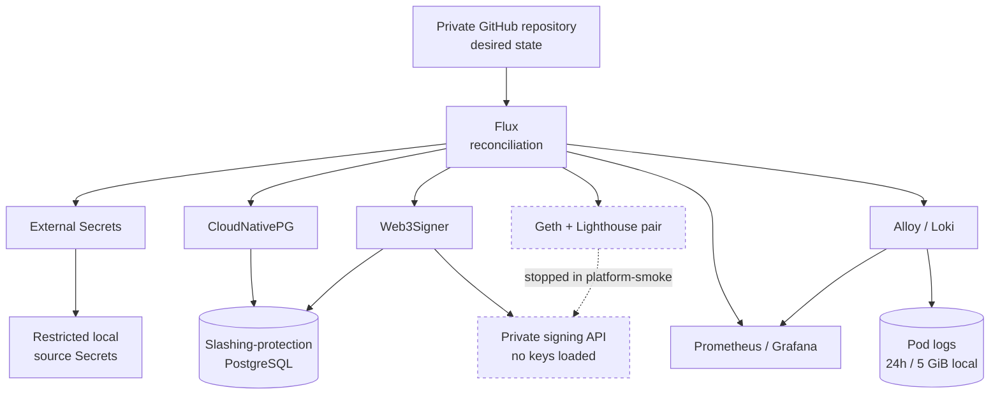

# Ethereum Validator Platform Lab

A spec-built, GitOps-operated Ethereum validator platform for learning and demonstrating institutional staking-platform practices. The platform is designed to run completely on local Kubernetes before its AWS adapters are provisioned on EKS.

| | |
|---|---|
| **Status** | Phase 2 — local platform services |
| **Network** | Hoodi testnet configuration |
| **Local profile** | `platform-smoke` (validator clients stopped) |
| **Signing** | Disabled — Web3Signer runs with an empty key store |
| **Reconciliation** | Flux, from a private GitHub repository |
| **Cloud resources** | EKS foundation applied; system tier active, Ethereum capacity scaled to zero |

The canonical product and architecture contract is [docs/prd/001-dynamic-validator-platform.md](docs/prd/001-dynamic-validator-platform.md). Where this README and the PRD disagree, the PRD is current and this file is stale.

## Why this exists

Running one validator is a weekend project. Running a fleet of them on behalf of customers is a key-custody problem wearing an infrastructure costume — the hard parts are signing-key handling, slashing protection, and proving that a machine which *looks* healthy is actually authorized to sign.

The scope of that custody is worth stating precisely, because it is narrower than it sounds. This platform holds encrypted **signing** keystores. It never holds withdrawal credentials, which stay in offline operator custody and are never imported (PRD §10.2). It therefore cannot move customer funds — but it can get a customer slashed. The controls here are custody-grade because the consequences are, not because the platform is a fund custodian.

This repository builds that platform the way a regulated operator would have to: the product contract is written and agreed before the code, every safety property is an explicit invariant rather than an emergent behavior, and the system is designed to fail closed when anything about identity, storage, or readiness is uncertain. It runs locally first so the Kubernetes and application contracts can be proven without an AWS bill or a funded key.

It is a lab, not a production service, and the documentation is written to keep that distinction honest.

## Design principles

Distilled from the seventeen safety invariants in PRD §5. These are product requirements — a change that violates one is rejected, not negotiated.

- **Fail closed.** If identity uniqueness, signer health, slashing storage, network identity, clock health, or sync readiness is uncertain, signing stays disabled.
- **Readiness is not authorization.** Kubernetes calling a pod `Ready` must never by itself imply permission to sign. Signing is the *final* gate, behind its own explicit conditions.
- **One key, one active assignment.** A validator identity is never admitted to more than one active client instance, and client switching breaks the old assignment before making the new one. This is exclusivity of *assignment*, not of storage — the shared signer tier deliberately holds many identities in one place.
- **Slashing history outlives workloads.** Stop, archive, client switch, Helm uninstall, and node replacement must not remove slashing-protection records.
- **Git holds policy, not secrets.** Public keys, stable IDs, and policy live in Git. Keystores, passwords, seed phrases, and withdrawal mnemonics do not — and withdrawal material stays out of Kubernetes, Terraform, and cloud backups entirely.
- **No silent key generation.** A recreated pod, volume, node, or cluster retrieves the existing identity or fails. It never quietly mints a replacement.
- **Every destructive transition is explicit.** Archive and deletion require stronger confirmation than stop, and removing a customer never implicitly deletes keys, slashing history, or an active on-chain validator.
- **Merge is the deployment authorization.** CI validates desired state; Flux reconciles it. Nobody applies application manifests from a workstation.

## Current implementation status

The two middle columns mean different things, and the difference is the point. **Declared implementation** is what the repository asserts: manifests on `main`, backed by CI, schema validation, chart renders, container runtime contracts, and server-side dry-run. **Runtime evidence** is what was actually observed running on a live cluster, cited at the commit where it was observed. Offline validation is not evidence that something works — only that it is well-formed and self-consistent.

| Capability | Declared implementation | Runtime evidence | Next |
|---|---|---|---|
| Product and architecture specification | Canonical repository baseline | *Not applicable* — specification and validation contracts are committed artifacts, not runtime state | Fold ADRs in as open questions close |
| Local `kind` cluster | Digest-pinned local cluster contract | Cluster creation and teardown guard verified | Unchanged until EKS parity work |
| Flux reconciliation | Controllers → infrastructure configs → signer prerequisites → apps | All five Kustomizations Ready — the four defined in `clusters/local` plus `flux-system` — observed at `b606121`, which predates the logging release | Re-verify once the logging release reconciles |
| Local PostgreSQL and shared Web3Signer | CloudNativePG, explicit versioned schema migration, and shared signer with an empty key store | Flyway applied migrations `00001`–`00012` with 12 successful history rows; Web3Signer 26.4.2 `1/1 Running`, connected to PostgreSQL, 0 keys loaded, observed at `b606121` | Slashing export/restore exercise |
| Prometheus and Grafana | Initial stack and smoke dashboards | Prometheus, Grafana, Alertmanager, and node exporter verified Ready at `b606121` | Populate validator dashboard levels in Phase 3 |
| Project home and operator portal | Responsive, public-safe visual shell and typed specialist-surface registry under `control-plane/portal`; read-only by contract | **Local build evidence only.** The portal has no live data adapters, public ingress, or authentication yet | Add a least-privilege read model, then Flux packaging and authenticated exposure |
| Logging (Alloy/Loki) | Flux-managed Loki and Alloy on `main`; node-scoped Pod-log collection through the Kubernetes API with no host log mounts, 24-hour retention on a 5 GiB local claim, provisioned Grafana datasource and log dashboard | **Offline validation only.** Chart renders, container runtime contracts, policy-port contract tests, and server-side dry-run pass. Live ingestion, retention, and dashboard behavior have not yet been observed | Capture live Flux, Loki, Alloy, and Grafana evidence |
| Real Geth/Lighthouse pair | Catalog-generated Flux HelmRelease plus a manual GitHub Actions activate/stop PR form; active means EL + beacon node only and signing remains disabled | **Offline validation only.** Stopped/active chart contracts and catalog-projection drift tests pass; no Flux lifecycle transition or client sync has been observed | Enable the documented Actions PR setting, exercise stopped → active → stopped through Flux, and capture sync/runtime evidence (Phase 3) |
| AWS foundation and EKS adapters | Terraform bootstrap and development roots declare an encrypted remote-state bucket, VPC, one EKS cluster, an on-demand system tier, zonal zero-minimum Ethereum groups with an explicit Spot experiment, EBS CSI and External Secrets Pod Identity, and an empty Engine JWT secret container. The encrypted `gp3` application StorageClass and its Hoodi PVC size profile are declared under `platform/infrastructure/configs/dev`, but no Flux entrypoint reconciles them. RDS, the AWS External Secrets store, and the EKS Flux overlay are not implemented yet | On 2026-08-02 a trusted-local saved plan created 90 resources in `us-west-2` on Kubernetes 1.35; the post-apply plan had zero drift, three nodes were Ready, and VPC CNI, CoreDNS, kube-proxy, EBS CSI, and Pod Identity pods were fully Running with zero restarts. Later the same day the zonal/Spot replacement was applied from the same trusted-local path — `21 added, 2 changed, 7 destroyed`, followed by a no-change plan. All four managed groups are `ACTIVE` with no health issues: one two-node on-demand system group plus three one-AZ Spot Ethereum groups. The initially active `us-west-2a` group obtained a Ready `r8i.2xlarge` Spot node — the diversified pool's first-preference type, so Spot fulfilled it without needing fallback; the replacement system nodes are Ready `m7i.large` in `us-west-2b` and `us-west-2c`; all EKS system pods were Running with zero restarts; and the observed node roots were encrypted baseline `gp3` — 40 GiB system and 30 GiB Ethereum. After confirming that no application pods, StatefulSets, or PVCs exist, an EKS `UpdateNodegroupConfig` call set the `us-west-2a` desired size to zero; all three Ethereum groups now report `0/1`, only the two system nodes remain, and a second post-pause plan again reported no changes — desired size is intentionally owned by the EKS operational boundary after creation. The `gp3` StorageClass was accepted by a server-side dry-run against that live cluster, but it has not been persisted or reconciled, and no application PVC or EBS volume exists | Guarded status/pause/resume tooling, then the remaining EKS adapters, before any client or signing workload lands |

Nothing in the repository authorizes validator signing by default. The local profile is `platform-smoke`, uses Hoodi configuration, and leaves validator clients stopped.

## Local architecture



The shared Web3Signer tier is a deliberate Phase 2 simplification: one signer backed by one durable slashing-protection database, which is what makes invariant 2 ("one durable slashing authority") cheap to enforce while the fleet is small. PRD §15.1 covers what has to be split, sharded, or made cell-local before this shape carries an institutional fleet.

Local infrastructure adapters are deliberately not described as AWS emulators. `kind`, local-path volumes, CloudNativePG, and the External Secrets Kubernetes provider prove the Kubernetes and application contracts. EBS, RDS, IAM/KMS, NLB behavior, Availability Zones, and Karpenter require the later EKS qualification.

## AWS operating boundary

Amazon EKS is the only cloud Kubernetes target for this project. The local
`kind` cluster is a development adapter, not a different production target;
there is no GKE or Google Cloud Terraform root in this repository.

The initial AWS operating model intentionally separates three writers:

| Writer | Owns | Does not own |
|---|---|---|
| Terraform, run from a trusted local workstation | Infrequent AWS foundation changes: VPC, one EKS cluster, node capacity, IAM/Pod Identity, EBS prerequisites, RDS, KMS/encryption policy, and secret containers | Helm releases, validator assignments, dashboards, or day-to-day application lifecycle |
| GitHub Actions | CI validation and reviewed catalog/application change requests | AWS plan/apply/destroy and direct Kubernetes mutation |
| Flux in EKS | Continuous reconciliation of controllers, platform services, client pairs, policies, and dashboards from merged Git | VPC, EKS, RDS, IAM, or other account-level AWS infrastructure |

The Terraform foundation now has a first runtime qualification, but it is not a
Phase 4-complete application environment. Its exact declared, observed, and
still-missing inventory—and the trusted-local plan/apply boundary—are documented
in [the development environment root](terraform/environments/dev/README.md).

## Start locally

Read [the local development runbook](docs/runbooks/local-development.md) before creating the cluster. The short path is:

```bash
make tools
make local-preflight
make local-up
make local-bootstrap
make local-seed
make local-status
```

Run `make check` before opening a pull request. Flux bootstrap requires the current commit to be pushed to the private GitHub repository and a valid `j2d3` GitHub token. Local secret material is generated or read only from `secrets/local/`, which is excluded from Git.

The operator-facing lifecycle form lives under **Actions → Request non-signing node-pair lifecycle**. It changes the assignment catalog and its generated Flux HelmRelease together, opens a PR, and has no AWS or Kubernetes credentials. The first slice can start or stop only Geth plus the Lighthouse beacon node; it cannot start a validator client. GitHub's repository-level “Allow GitHub Actions to create and approve pull requests” setting must be enabled before the form can open its first PR, and PR-triggered CI created with `GITHUB_TOKEN` may require a write collaborator to approve the run. Those are GitHub control-plane prerequisites, not application permissions.

## Documentation

| Document | What it answers |
|---|---|
| [PRD](docs/prd/001-dynamic-validator-platform.md) | What the product is, what it must never do, and how it is phased. The contract. |
| [ADRs](docs/adrs/) | Why a specific decision was made and what it cost. |
| [Local development runbook](docs/runbooks/local-development.md) | How to bring the cluster up, verify it, and take it down safely. |
| [EKS capacity runbook](docs/runbooks/eks-capacity.md) | How to inspect, pause, and resume one zonal Ethereum worker without changing validator lifecycle or signing state. |
| [Dependabot runbook](docs/runbooks/dependabot.md) | How scheduled version updates differ from alerts and automated security fixes, and how to verify each. |
| [Production evolution](docs/production-evolution.md) | What changes between local qualification and EKS — and what a green local cluster does *not* prove. |
| [COLLABORATION.md](COLLABORATION.md) | How the human and the AI agents coordinate, review, and merge. |
| [CONTRIBUTING.md](CONTRIBUTING.md) | Branch, PR, and review process. |
| [SECURITY.md](SECURITY.md) | Reporting and handling expectations. |

## Repository map

| Path | Purpose |
|---|---|
| `docs/prd` | Canonical product and architecture specification |
| `docs/adrs` | Durable decisions and their tradeoffs |
| `docs/runbooks` | Operator procedures and safety checks |
| `applications` | Schema-validated customer, profile, identity, and assignment catalog |
| `schemas` | Desired-state JSON Schema contracts |
| `tools` | Relational catalog validation, deterministic local Flux projection, lifecycle mutation, and container-contract validation |
| `hack` | Pinned local-tool, cluster, secret-seeding, and merge commands |
| `clusters/local` | Flux reconciliation entry point for local Kubernetes |
| `platform/infrastructure/controllers` | Flux-managed platform operators |
| `platform/infrastructure/configs/local` | Local StorageClass, secret, and database adapters |
| `platform/infrastructure/configs/dev` | EKS adapters — currently the encrypted `gp3` chain-data StorageClass; declared and CI-validated, reconciled by nothing yet |
| `platform/apps/base` | Environment-independent application manifests |
| `platform/apps/local` | Local profile and dashboard composition |
| `control-plane/portal` | Public-safe project home and future authenticated operator workspace |
| `charts/ethereum-node` | First Geth/Lighthouse vertical slice under runtime qualification |
| `terraform` | Locally applied AWS bootstrap and single-EKS-environment roots; never application desired state |

## How work happens here

This repository is built by a human operator working with two AI coding agents — Claude Code and OpenAI Codex — coordinating in the open through GitHub. The full model is in [COLLABORATION.md](COLLABORATION.md); the short version:

- Work is claimed on the pinned coordination issue before it starts, with an explicit lease.
- Every pull request is cross-reviewed by the *other* agent. No agent approves its own work.
- Authors merge their own PRs through `./hack/merge-pr.sh`, which fails closed unless the paired agent approved the exact current head and CI is green. A lifecycle PR authored by `github-actions[bot]` is the narrow exception: both agents approve it, then either may run the wrapper's single-commit rebase path.
- Disagreements are settled in the open on the pull request — through evidence, revision, and re-review against the exact head — not privately, and not by escalating as a reflex. Only an unresolved material design choice, a request for new authority, or a real expansion of scope or blast radius goes to the human. The disagreement itself is the point: two independent reviewers catch what one would rationalize away, which is what makes the arrangement worth its overhead.

One known asymmetry: Claude Code operates under an isolated `5u6r054` collaborator account, but Codex still acts through the human's own `j2d3` account. GitHub's audit trail therefore cannot distinguish "the human as `j2d3`" from "Codex as `j2d3`" on review approvals. A dedicated Codex identity is the planned fix and is tracked as a priority follow-up in COLLABORATION.md.

The human owns both accounts, retains override on every action, and is accountable for what the agents do as them.

## Roadmap

Phases are defined in PRD §18; each has an explicit exit criterion.

| Phase | Focus | State |
|---|---|---|
| 0 | Agree on the product | Complete |
| 1 | Reproducible local GitOps foundation | Complete |
| 2 | Local platform services — secrets, database, signer, observability, logging | In progress |
| 3 | First vertical slice: one identity through a full safe lifecycle | Started — non-signing catalog/Flux lifecycle path declared; runtime cycle not yet evidenced |
| 4 | Reproducible AWS foundation and EKS parity | In progress — foundation applied and cluster/add-ons qualified; application adapters incomplete |
| 5 | Dynamic client matrix across four EL and four CL implementations | Not started |
| 6 | Customer Service control plane | Not started |
| 7 | Archive and recovery, including fail-closed exercises | Not started |
| 8 | Scale and production design exercise | Not started |

Phase 2 exits when the local signer, database, GitOps, and observability safety services are all healthy — before any validator node exists.

## Safety boundary

No mnemonic, withdrawal credential, unencrypted validator key, keystore password, AWS credential, or plaintext secret belongs in Git, Terraform state, container images, workflow logs, or ordinary application manifests. A synced node is not automatically a validator, and a running Web3Signer with an empty key directory cannot sign.
