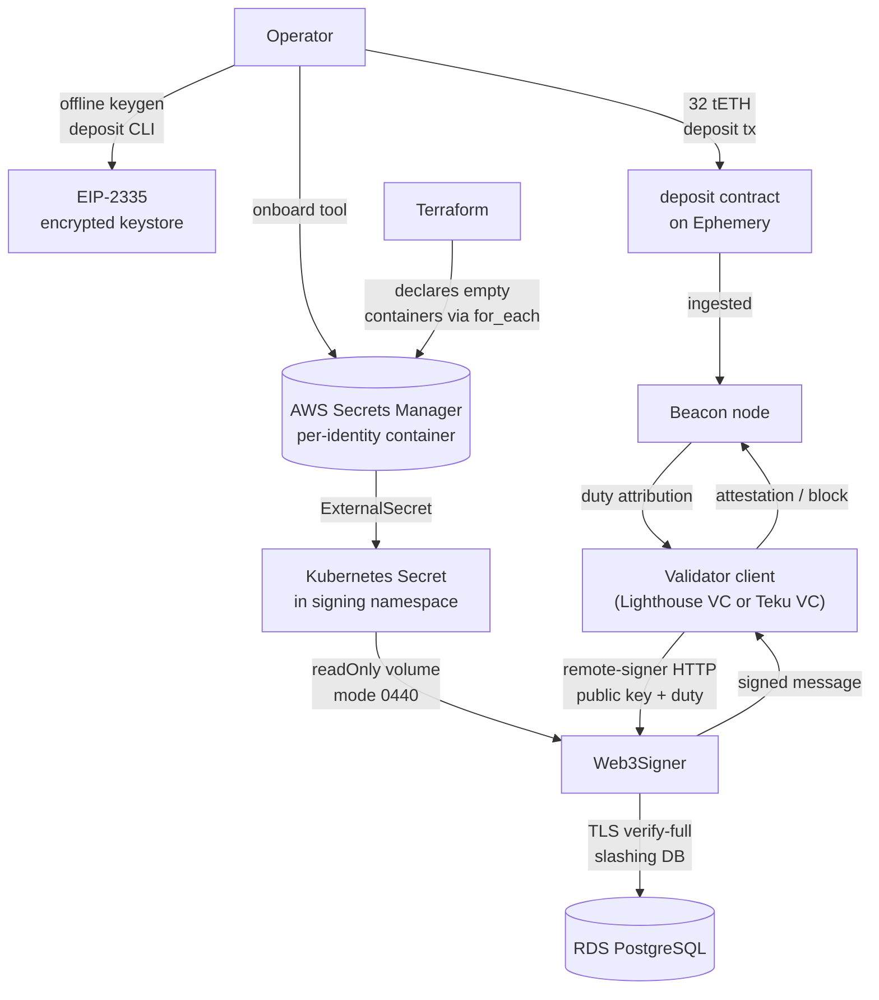

# System overview

How the pieces fit together at the platform layer. This page is durable —
it should still be accurate a year from now. Point-in-time state lives on
the [live portal](https://g.j2d3.com) and in
[`docs/evidence/`](../evidence/).

## The three control planes

The platform runs on three writers with strictly separated ownership. When
the same fact is asserted by two, one is stale.

| Writer | Owns | Does not own |
|---|---|---|
| **Terraform**, run from a trusted operator workstation | AWS foundation: VPC, EKS cluster, managed node groups, IAM + Pod Identity, RDS, Secrets Manager containers, EBS prerequisites, ACM, Route 53 | Helm releases, validator assignments, dashboards, application lifecycle |
| **GitHub Actions** | CI validation and reviewed catalog/application change requests | AWS apply/destroy, direct Kubernetes mutation |
| **Flux** in EKS | Continuous reconciliation of controllers, platform services, client pairs, policies, dashboards from `main` | VPC, EKS, RDS, IAM, or any account-level AWS resource |

Terraform, run from a trusted operator workstation, applies infrequent
AWS foundation changes. The **human operator** owns everything above plus:
key generation, testnet deposits, guarded emergency action, and every
irreversible or security-sensitive decision. See
[`safety-and-custody-boundaries.md`](safety-and-custody-boundaries.md).

## The reconciliation chain

Flux Kustomizations reconcile in a dependency chain:

```text
infrastructure-controllers        (Flux, ESO, cert-manager, node-exporter, kube-prometheus-stack)
    └─ infrastructure-configs     (StorageClasses, common ConfigMaps, SecretStores)
        ├─ portal-observability   (public status API, portal ingress, Grafana provisioning)
        ├─ signer-infrastructure-configs   (signer namespace, network policies, secret stores)
        │   └─ signer-prerequisites        (ExternalSecrets, Flyway schema migration Job)
        │       └─ apps                     (Web3Signer Deployment, key projection ExternalSecret)
        │           └─ node-apps            (client-pair HelmReleases)
```

The strict ordering enforces safety invariants at the platform layer:
`node-apps` cannot admit a validator client until `apps` (Web3Signer) is
Ready; `apps` cannot admit Web3Signer until `signer-prerequisites` (schema
migration, encrypted keystore projection) is Ready; and so on. Details in
[`components/flux-reconciliation.md`](../components/flux-reconciliation.md).

## The client-pair catalog model

The `applications/` tree holds a relational catalog of five kinds:

| Kind | Cardinality | Purpose |
|---|---|---|
| `Customer` | 1..N | Business tenancy grouping |
| `NetworkProfile` | 1 per network | Chain identity + artifact bundle + signer binding |
| `ServiceProfile` | 1 per pair-type | Which EL + which CL + tenancy + resource profile |
| `ValidatorIdentity` | 1 per pubkey (or synthetic) | Public identifier + `signingSecretRef` pointer |
| `ValidatorAssignment` | 1 per running pair | Ties an identity to a service profile on a network |

`tools/render_local_assignments.py` projects the relational catalog into
Flux `HelmRelease` manifests. The projection tool is the load-bearing
validator: any assignment whose bindings can't be resolved (unknown
identity, unimplemented client adapter, safety flags not confirmed for a
signing assignment, synthetic identity attempting to sign) fails
projection before Kubernetes ever sees it.

Details in
[`components/desired-state-catalog.md`](../components/desired-state-catalog.md).

## The signing pipeline



Every stage has a fail-closed gate. Web3Signer + RDS is the single durable
slashing authority; the validator client's local slashing bookkeeping is
disposable. See
[`components/secrets-and-key-projection.md`](../components/secrets-and-key-projection.md)
and
[`components/web3signer-and-slashing-protection.md`](../components/web3signer-and-slashing-protection.md).

## Public observability boundary

The public reader path (portal at `g.j2d3.com` + status API at
`ops.g.j2d3.com/api/status`) exposes aggregate telemetry only. The API
adapter strips customer, validator, key, Pod, node, and AWS identifiers
before serving; it also refuses caller-supplied PromQL. Grafana anonymous
Viewer access is deliberately enabled for the demo — anonymous callers can
issue arbitrary PromQL against the cluster datasource (nothing under that
datasource is secret in the testnet lab; the configuration is not
appropriate for production). See
[`components/observability-and-portal.md`](../components/observability-and-portal.md).

## Environments

**Amazon EKS is the only cloud Kubernetes target** for this project. There
is no GKE, AKS, or other-cloud Terraform root; the local `kind` profile is a
development adapter, not a different production target.

- **Local `kind`** (`clusters/local/`, `platform/apps/local/`): chart and
  Kubernetes-contract development without AWS cost. Does not reproduce
  IAM, RDS, EBS, VPC, or NLB behavior.
- **EKS dev** (`clusters/dev/`, `platform/apps/{prerequisites,dev,nodes,portal}/dev/`):
  the operating environment. One EKS 1.35 cluster in `us-west-2`, one
  Single-AZ RDS instance, one Web3Signer replica, five client pairs.
- **No mainnet target.** Deliberately absent; PRD §11.3 documents the
  gates that would be required.
