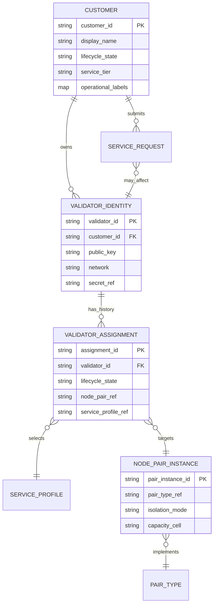
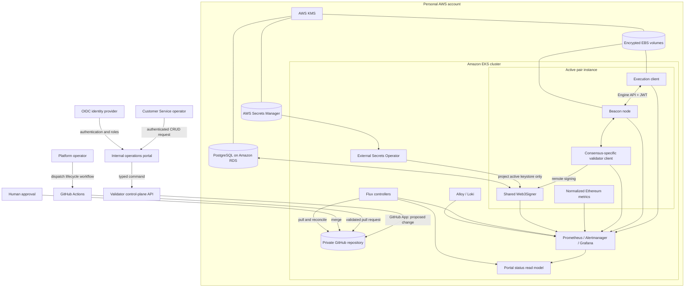
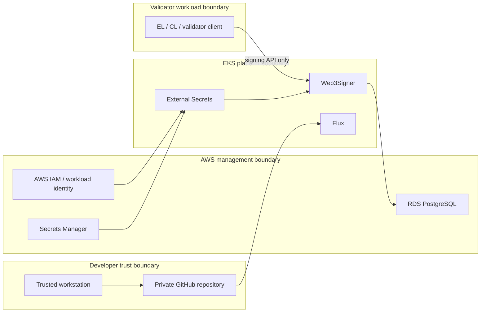
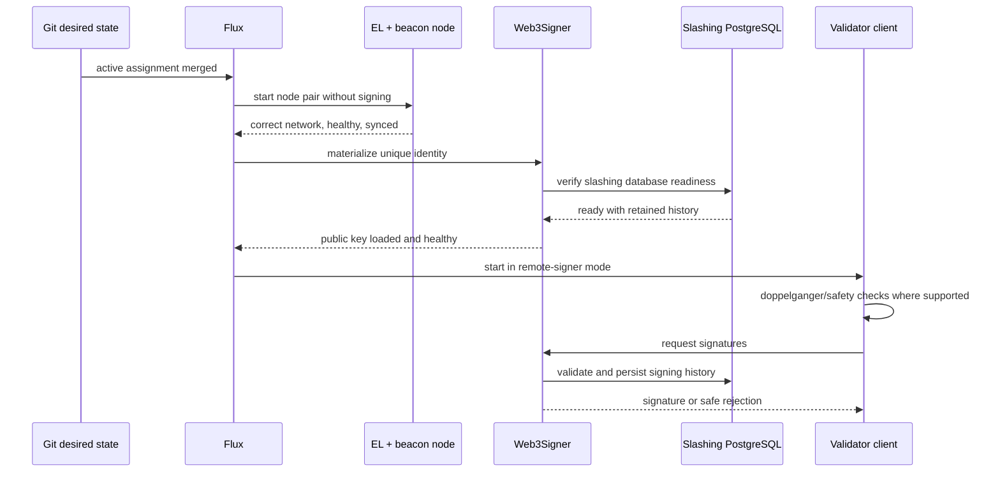
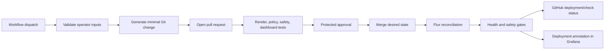
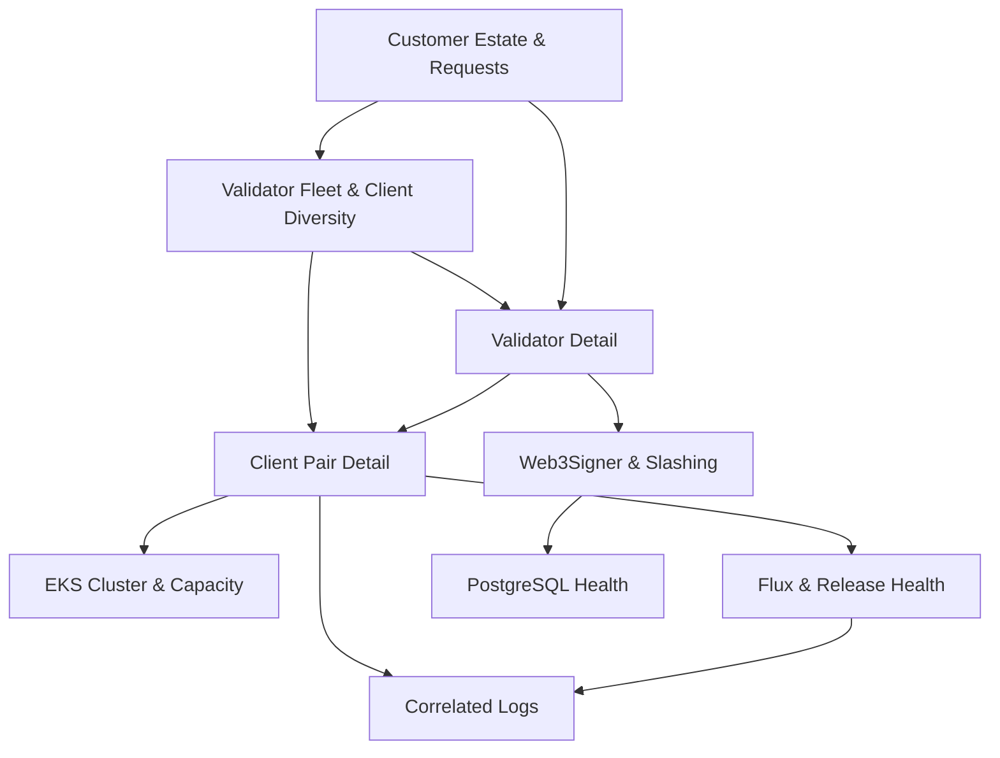
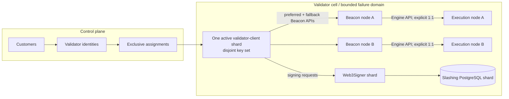

# Dynamic Ethereum Validator Platform

> **Product requirements and architecture specification**<br>
> A safe, GitOps-operated Ethereum validator laboratory, runnable locally before Amazon EKS

| Document | Value |
|---|---|
| Status | **Approved architecture baseline** |
| Version | 0.1.0 |
| Owner | the human |
| Repository | `j2d3/eth-validator-platform` (private) |
| Initial environments | One local `kind` cluster, followed by one AWS EKS cluster; one Ethereum testnet |
| Operating model | Terraform bootstraps infrastructure; Flux owns in-cluster state |
| Review rule | This specification is agreed before implementation is committed |

---

## 1. Product vision

This project builds a **dynamic, fully automated Ethereum validator platform**.

An operator chooses an execution client, a consensus client, a validator identity, and a desired lifecycle action. The platform launches or retires the corresponding validator stack on EKS, keeps signing keys outside Git, preserves slashing history across every transition, and exposes enough telemetry to understand the validator, its client pair, the signer, and the Kubernetes cluster as one system.

The laboratory mirrors the boundaries of a larger institutional staking platform while fitting inside one personal AWS account. All sixteen execution/consensus client combinations are represented in the catalog and schema-validated in CI; one or two run at a time.

### 1.1 Product promise

Given a registered testnet validator identity, the platform will let an authorized operator:

1. Select any supported execution/consensus client pair.
2. Request activation through a guarded GitHub workflow.
3. Have Git become the reviewed desired-state record.
4. Have Flux reconcile that state into EKS.
5. Start signing only after the node pair, signer, key assignment, and slashing database pass safety gates.
6. Observe validator effectiveness, client health, signing behavior, GitOps health, and cluster health in Grafana.
7. Stop, archive, move, and reactivate the same identity without losing its key reference or slashing history.

### 1.2 Why this product exists

The product is an educational model of the platform responsibilities behind institutional Ethereum staking:

- mixed execution and consensus client operations;
- remote signing and durable slashing protection;
- Kubernetes scheduling, storage, and failure domains;
- GitOps change control and reconciliation;
- safe validator lifecycle automation;
- normalized telemetry across heterogeneous clients;
- operational reasoning about validator safety, liveness, scale, and cost.

It is **not** a claim that a one-cluster testnet lab is production-ready for institutional assets. The specification calls out the changes required to evolve it toward that standard.

---

## 2. Goals, non-goals, and success measures

### 2.1 Goals

| ID | Goal |
|---|---|
| G-01 | Provision one reproducible EKS foundation with Terraform, initially applied from a trusted local workstation. |
| G-02 | Establish Flux as the only continuous reconciler of Kubernetes application state. |
| G-03 | Represent all 16 supported execution/consensus pair types declaratively. |
| G-04 | Run one or two pair instances at a time and scale validator workload capacity down when stopped. |
| G-05 | Use a shared Web3Signer service and durable PostgreSQL slashing-protection database. |
| G-06 | Keep private signing material out of Git, Terraform state, container images, GitHub logs, and ordinary application namespaces. |
| G-07 | Automate register, activate, stop, archive, reactivate, and client-switch workflows with explicit safety gates. |
| G-08 | Provide detailed per-validator, per-pair, signer, fleet, GitOps, and EKS dashboards as version-controlled code. |
| G-09 | Exercise every supported client pair and record compatibility findings and runbooks. |
| G-10 | Make architecture decisions, tradeoffs, failure modes, and learning visible in repository documentation. |
| G-11 | Model customers and their validator estates declaratively, with safe CRUD workflows and a future Customer Service portal. |
| G-12 | Preserve an auditable customer → validator → assignment relationship without coupling customer lifecycle to Terraform. |
| G-13 | Run and qualify the complete application/GitOps path on a local Kubernetes environment before creating billable AWS infrastructure. |
| G-14 | Provide one attractive project home and operator index that explains the platform, preserves evidence provenance, and links every specialist visibility surface without replacing its source of truth. |

### 2.2 Non-goals for the first release

- Mainnet validation or custody of funds with real economic value.
- Ten-thousand-validator capacity testing.
- Production-grade multi-region active/standby operation.
- Automated Ethereum deposits or automated withdrawal-key custody.
- Home-grown key management, signing, consensus, or slashing algorithms.
- A custom Kubernetes operator before plain GitOps resources prove insufficient.
- GitHub Actions ownership of routine Kubernetes reconciliation.
- Automatic Terraform apply from pull requests in the initial one-cluster lab.
- Guaranteed zero-downtime switching between consensus clients; safety is preferred over liveness.
- Storage of customer PII, contracts, billing records, or support notes in Git.
- A customer-facing staking portal in v1; the planned portal is an internal Customer Service and platform-operations interface.

### 2.3 Success measures

The first complete release is successful when:

- a local cluster and its complete application stack can be created and removed from documented commands without AWS credentials;
- the cluster can be rebuilt from documented Terraform and bootstrap steps;
- Flux reports all platform and application resources healthy;
- each of the 16 pair definitions passes render, schema, policy, and metrics-contract tests;
- at least one funded testnet validator completes a full active → stopped → reactivated → archived lifecycle;
- the same identity can move between at least two distinct client pairs without double signing;
- Web3Signer rejects a deliberately conflicting signing test and records the rejection;
- dashboards show validator duties, pair health, signer health, fleet state, GitOps state, and EKS capacity;
- alerts are tested, link to runbooks, and are distinguishable from expected maintenance;
- secrets are absent from Git history, rendered manifests, Terraform state, and workflow logs;
- the full lifecycle can be explained and operated from repository documentation.

---

## 3. Users and product journeys

### 3.1 Primary user: platform operator

The initial operator is a platform engineer who understands AWS, Terraform, containers, and Kubernetes but is intentionally learning Flux, Web3Signer, and validator operations.

The operator needs the platform to make dangerous states hard to express, expose what automation is doing, and make every lifecycle transition reviewable and reversible where possible.

### 3.2 Core journeys

#### Register an identity

The operator creates a validator key through an approved offline/testnet process, completes any necessary deposit outside the platform, stores the encrypted signing keystore and its password in the environment's approved external secret source, and submits only the public key and secret reference to Git. AWS uses Secrets Manager; local development uses an operator-seeded, Git-ignored bootstrap source consumed through the same External Secrets contract.

Registration does not start clients or signing.

#### Activate a validator pair

The operator dispatches a GitHub workflow with:

- validator identity;
- execution client;
- consensus client;
- network;
- storage profile;
- optional maintenance annotation.

The workflow validates the request, changes desired state on a branch, runs all policy checks, and opens a pull request. Merge authorizes Flux to reconcile the active workload. Activation succeeds only when readiness and signing-safety gates pass.

#### Stop safely

The operator requests stop. The validator client stops signing first, the signer assignment is withdrawn, and node workloads scale to zero. Chain-data volumes remain so a later activation can avoid a full resync. The validator identity and slashing history remain durable.

#### Archive

The operator requests an explicitly destructive archive action. The platform proves the validator is not signing, optionally snapshots chain-data volumes, removes the client resources and chain-data volumes, and retains the identity record, AWS secret, and PostgreSQL slashing history. Reactivation requires a resync or snapshot restore.

#### Switch clients

The operator selects a new pair for an existing validator identity. The platform performs a break-before-make transition: stop duties, remove signer admission, enforce a safety delay and doppelganger checks, start and sync the new pair, then re-admit the key. Simultaneous assignment of one public key to two active instances is forbidden.

#### Diagnose a missed duty

From one Grafana landing page the operator can move from a validator duty miss to signer latency/rejections, consensus and execution sync status, peer health, pod events/logs, node pressure, Flux drift, and the deployment change that preceded the incident.

#### Enter through the project home

The operator starts at a purpose-built portal rather than remembering a list of
ports and tool URLs. The public-safe home explains the product, safety boundary,
architecture, client/network coverage, implementation phase, and evidence
quality. The authenticated workspace later adds fleet, customer, lifecycle,
capacity, cost, alert, and change summaries and carries context into Grafana,
Loki, Flux, GitHub, AWS, chain explorers, and runbooks.

The home never collapses declared, reconciled, and observed state into a single
health value. Every operational field names its authoritative source and
freshness. Specialist tools retain ownership of detailed analysis, while the
portal remains the navigation and explanation layer above them.

### 3.3 Secondary user: Customer Service operator

A Customer Service operator should not need to understand Helm, Kustomize, Terraform, Kubernetes, or client flags. They need a constrained product interface that can:

- onboard a customer record with an opaque customer ID and approved operational metadata;
- see the customer’s validators, beacon-chain states, platform states, client assignments, health, and open incidents;
- request a new validator registration or activation using approved profiles;
- update non-sensitive customer and validator metadata;
- request a safe stop, client migration, or offboarding action;
- see the approval and reconciliation status of each request;
- never display or retrieve private keys, keystore passwords, withdrawal material, database credentials, or raw AWS secrets.

Customer Service can initiate work, but safety-sensitive transitions remain policy-controlled. Archive, key deletion, validator exit, customer offboarding, and break-glass actions require a Platform Approver and, where key custody is involved, a Key Custodian.

### 3.4 Customer and validator journeys

#### Onboard a customer

The operator submits a customer form. The control plane validates allowed metadata, creates a proposed declarative customer resource, and opens a pull request. Merge creates the logical customer boundary, dashboard filters, ownership labels, quotas/policies if configured, and an audit record. It does not create AWS infrastructure unless the selected service tier explicitly calls for a dedicated infrastructure cell.

#### Add validators to a customer

The operator selects an existing customer and requests one or more validator registrations. Key custody/import is completed through its separate restricted workflow. The platform then records public identities and creates assignments using approved client, network, isolation, resource, and maintenance profiles.

#### Change a customer or validator

Ordinary metadata changes can follow a low-risk approval policy. Client, network, key, placement, and lifecycle changes are classified as operational changes and invoke the corresponding guarded workflow. Free-form client flags are not exposed in the Customer Service interface.

#### Offboard a customer

“Delete customer” is presented as **offboard**, not as an unqualified delete. The control plane inventories every associated validator, blocks new activations, safely stops or separately exits validators according to the approved plan, resolves custody and retention obligations, archives replaceable runtime data, and retains a tombstone/audit record. On-chain validator history and slashing history are not deletable Kubernetes objects.

#### Track request status

The portal shows the complete progression:

```text
requested → validated → awaiting approval → merged → reconciling → healthy | failed-safe
```

It links the business request to the pull request, commit, Flux reconciliation, validator/pair dashboards, and any required operator action.

---

## 4. Product vocabulary and state model

| Term | Meaning |
|---|---|
| **Customer** | A stable, opaque tenant identity and non-sensitive operational metadata. It is not a Kubernetes user or a container workload. |
| **Identity** | An Ethereum validator public key plus an immutable reference to encrypted signing material. |
| **Assignment** | The exclusive mapping that authorizes an identity to use a validator-client deployment and node-pair target. |
| **Service profile** | An approved bundle of client, isolation, resource, storage, observability, and maintenance policy exposed to Customer Service. |
| **Pair type** | One execution client and one consensus client combination. |
| **Pair instance** | A deployed or retained realization of a pair type for a network and validator assignment. |
| **Validator client** | The duty/signing component associated with the chosen consensus client. |
| **Node pair** | Execution client plus beacon node, connected through Engine API authentication. |
| **Signer admission** | Whether a registered identity is currently exposed through Web3Signer for an approved active assignment. |
| **Platform state** | Desired lifecycle state stored in Git. |
| **Beacon state** | On-chain status such as deposited, pending, active, exited, or withdrawable. It is observed, not controlled by Kubernetes. |
| **Archive** | Removal of compute and chain data while retaining identity and slashing-protection records. |

### 4.1 Platform lifecycle

```mermaid
stateDiagram-v2
    [*] --> Registered: import public identity and secret reference
    Registered --> Activating: approved activation PR merged
    Activating --> Active: sync and signing gates pass
    Activating --> FailedSafe: timeout or failed safety gate
    FailedSafe --> Activating: fault corrected and retried
    FailedSafe --> Stopped: abandon activation
    Active --> Stopping: approved stop or emergency stop
    Stopping --> Stopped: signing disabled; compute is zero
    Stopped --> Activating: reactivate same identity
    Stopped --> Archiving: explicit archive approval
    Archiving --> Archived: optional snapshot complete; data removed
    Archived --> Activating: recreate and resync or restore
    Active --> Switching: client migration requested
    Switching --> Stopped: old pair safely disabled
    Stopped --> Activating: new pair selected
```



### 4.2 State semantics

| State | Client compute | Chain-data PVC | Key in external secret source | Key admitted to Web3Signer | Slashing history | May sign |
|---|---:|---:|---:|---:|---:|---:|
| Registered | No | No | Retained | No | Retained/initialized | No |
| Activating | Starting | Retained/created | Retained | Not until gates pass | Retained | No |
| Active | Yes | Retained | Retained | Yes | Read/write | Yes |
| Failed-safe | Zero or quarantined | Retained | Retained | No | Retained | No |
| Stopped | No | Retained | Retained | No | Retained | No |
| Archived | No | No; optional snapshot | Retained | No | Retained | No |

The on-chain validator may remain **active** while the platform state is stopped or archived. That causes missed duties and penalties but must never cause double signing. Platform liveness and beacon-chain activation are intentionally separate concepts.

### 4.3 Customer and validator domain model



The boundaries are intentional:

- a **customer owns validator identities**;
- an identity has at most one active assignment but retains assignment history;
- an assignment selects a controlled service profile rather than arbitrary container flags;
- a node pair can be dedicated to one assignment or shared by multiple compatible assignments;
- a customer may receive dedicated node/signing capacity as a service-tier policy without changing the identity model;
- customer records contain opaque IDs and operational metadata; systems of record for PII, contracts, billing, and support cases remain external and are referenced by ID only.

The lab begins with one dedicated node pair per active validator assignment because that makes every client combination easy to isolate and learn. The product model does **not** require that 1:1 topology at scale. A fleet of 10,000 validators would normally route many identities through carefully sized client pools/cells, not run 10,000 execution and 10,000 consensus nodes.

### 4.4 Customer lifecycle

```mermaid
stateDiagram-v2
    [*] --> Draft
    Draft --> Onboarding: request validated
    Onboarding --> Active: approved customer state reconciled
    Active --> Suspended: new activity blocked
    Suspended --> Active: approved reinstatement
    Active --> Offboarding: offboard approved
    Suspended --> Offboarding: offboard approved
    Offboarding --> Offboarded: all validator dispositions complete
    Offboarded --> [*]: retention expires; tombstone remains
```



Removing a YAML file is not an acceptable first step for customer deletion. The customer must first enter `offboarding`; every owned validator receives an explicit disposition such as transfer, stop, voluntary exit, or archive; key custody and retention are resolved; and only then can active resources be garbage-collected. Voluntary exit is an irreversible Ethereum operation and is always a separate, strongly approved action.

---

## 5. Safety invariants

These are product requirements, not implementation suggestions. A design or change that violates one is rejected.

1. **One active assignment per public key.** A validator identity must never be admitted to more than one active validator-client instance.
2. **One durable slashing authority.** Every signing request for managed identities passes through the shared Web3Signer tier backed by durable PostgreSQL slashing protection.
3. **Break before make.** Client switching removes the old signer assignment before creating the new active assignment.
4. **No private key in Git.** Git contains public keys, secret identifiers, and policy—not keystores, passwords, seed phrases, or plaintext private keys.
5. **No withdrawal mnemonic online.** Deposit and withdrawal credentials remain outside Kubernetes, GitHub, Terraform, Web3Signer, and ordinary cloud backups.
6. **No key generation on pod restart.** A recreated pod, volume, node, or cluster must retrieve the existing identity; it must never silently create a replacement.
7. **Signing is the final readiness gate.** Kubernetes readiness alone must never imply permission to sign.
8. **Slashing history outlives workloads.** Stop, archive, client switch, Helm uninstall, and EKS node replacement must not remove slashing-protection records.
9. **Fail closed.** If identity uniqueness, signer health, slashing storage, network identity, clock health, or sync readiness is uncertain, signing remains disabled.
10. **Network binding is immutable.** An identity assignment cannot be silently moved between Ethereum networks or chain IDs.
11. **Every destructive transition is explicit.** Archive and data deletion require stronger confirmation than stop.
12. **Git merge is ordinary deployment authorization.** GitHub Actions prepares and validates desired state; Flux performs reconciliation.
13. **Emergency stop is bounded.** A break-glass path may reduce risk immediately, but it must leave an auditable record and be reconciled back into Git.
14. **Metrics never expose secrets.** Public keys may be selectively labeled; keystore paths, passwords, seed data, and secret values must not appear in logs or labels.
15. **Customer deletion is an offboarding workflow.** Removing a customer must never implicitly delete keys, slashing history, or an active on-chain validator.
16. **Customer Service receives profiles, not raw infrastructure controls.** Unreviewed client flags, images, networks, secret paths, and destructive storage settings are never free-form portal inputs.
17. **Git is not the customer system of record for sensitive business data.** Only stable IDs and operational metadata required for reconciliation belong in desired state.

---

## 6. Supported client matrix

The platform defines the complete 4 × 4 matrix. A pair includes the selected consensus client’s own validator-client implementation so client-specific remote-signing behavior is actually exercised.

| Execution ↓ / Consensus → | Lighthouse | Prysm | Teku | Nimbus |
|---|:---:|:---:|:---:|:---:|
| **Geth** | `geth-lighthouse` | `geth-prysm` | `geth-teku` | `geth-nimbus` |
| **Nethermind** | `nethermind-lighthouse` | `nethermind-prysm` | `nethermind-teku` | `nethermind-nimbus` |
| **Besu** | `besu-lighthouse` | `besu-prysm` | `besu-teku` | `besu-nimbus` |
| **Reth** | `reth-lighthouse` | `reth-prysm` | `reth-teku` | `reth-nimbus` |

### 6.1 Pair contract

Every pair definition must provide the same platform-facing contract despite client-specific flags:

- explicit network and genesis identity;
- authenticated Engine API connection with a generated JWT secret;
- execution JSON-RPC endpoint restricted by network policy;
- Beacon REST endpoint restricted by network policy;
- consensus checkpoint-sync configuration where supported;
- peer-to-peer service and stable discovery identity where appropriate;
- persistent execution and consensus data directories;
- Prometheus-compatible metrics endpoints;
- health, readiness, and startup probes based on meaningful client state;
- resource requests, limits, disruption constraints, and storage class;
- a validator-client mode configured for Web3Signer remote signing;
- normalized labels for network, identity, pair type, client names, and versions;
- graceful shutdown budgets long enough to flush databases;
- a documented client-specific troubleshooting runbook.

### 6.2 Version policy

- Images are pinned to immutable digests in deployable environments.
- Human-readable client versions remain beside digests for review.
- Automated dependency PRs propose upgrades; they do not deploy directly.
- CI renders and validates all sixteen combinations for every chart change.
- Client upgrades roll through a canary identity/pair before broader use.
- Mixed versions must be observable during rollout.
- Network upgrade readiness is tracked as an operational requirement, not left to image-tag automation.

### 6.3 Network and port contract

A port number is a configurable convention, not a protocol definition. The same number can carry different protocols on TCP and UDP, and different clients choose different defaults for equivalent APIs. The platform therefore uses stable semantic Kubernetes port names—such as `el-engine`, `cl-beacon-api`, and `metrics`—while each client adapter supplies its actual `targetPort`, command-line flags, health checks, and advertised P2P address.

The protocols have distinct trust and exposure requirements:

| Interface | Transport and application protocol | Normal direction | Exposure |
|---|---|---|---|
| Execution discovery | UDP; Ethereum discovery v4, and optionally discovery v5, using signed node records and discovery messages | EL ↔ public EL peers | Public P2P |
| Execution peer traffic | TCP; encrypted RLPx/devp2p sessions carrying the `eth` wire protocol and optional `snap` synchronization protocol | EL ↔ public EL peers | Public P2P |
| Consensus discovery | UDP; discovery v5 using Ethereum Node Records | BN ↔ public BN peers | Public P2P |
| Consensus peer traffic | TCP/libp2p or QUIC/UDP; GossipSub topics and request/response streams, with consensus objects encoded in SSZ and normally Snappy-compressed | BN ↔ public BN peers | Public P2P |
| Engine API | HTTP carrying JSON-RPC 2.0 Engine methods, authenticated with a shared JWT secret | BN → paired EL | Pair-private only |
| Execution JSON-RPC | HTTP or WebSocket carrying JSON-RPC 2.0 methods such as `eth_*`, `net_*`, and explicitly enabled diagnostic namespaces | Restricted tools → EL | Private; public RPC is out of scope |
| Beacon API | HTTP REST defined by the standard Beacon API; JSON by default and SSZ on supported endpoints/content negotiation | VC, probes, and restricted tools → BN | Cluster-private only |
| Prysm legacy RPC | gRPC over HTTP/2 with Protocol Buffers | Prysm VC/tools → Prysm BN | Cluster-private only; prefer standard REST as Prysm transitions away from gRPC |
| Remote signer | HTTP REST/JSON using the Ethereum remote-signing API; requests identify a public key and contain a typed signing object | VC → Web3Signer | Signer-private only |
| Metrics | HTTP using the Prometheus text/OpenMetrics exposition format | Prometheus → workload | Observability-private only |
| Slashing database | PostgreSQL frontend/backend wire protocol over TLS | Web3Signer → RDS PostgreSQL | VPC-private only |
| Builder API, when enabled | HTTP using the Ethereum Builder API with JSON and/or SSZ payloads | BN/VC → MEV-Boost; MEV-Boost → relays | Cluster-private outbound path |

Current upstream execution-client defaults are listed below. Every one remains explicit in our adapter rather than being inherited silently:

| Execution client | P2P defaults | User/query APIs | Engine API | Metrics |
|---|---|---|---|---|
| Geth | `30303/TCP` RLPx; `30303/UDP` discovery | `8545/TCP` HTTP JSON-RPC; `8546/TCP` WebSocket JSON-RPC | `8551/TCP` HTTP JSON-RPC + JWT | `6060/TCP` HTTP when enabled |
| Nethermind | `30303/TCP` RLPx; `30303/UDP` discovery | `8545/TCP` HTTP and WebSocket JSON-RPC | `8551/TCP` HTTP JSON-RPC + JWT | Explicit adapter setting; current configuration reference defines no universal port default |
| Besu | `30303/TCP` RLPx; `30303/UDP` discovery | `8545/TCP` HTTP JSON-RPC; `8546/TCP` WebSocket; `8547/TCP` GraphQL | `8551/TCP` HTTP JSON-RPC + JWT | `9545/TCP` HTTP when enabled |
| Reth | `30303/TCP` RLPx; `30303/UDP` discovery v4; optional discovery-v5 listener is separately configurable | `8545/TCP` HTTP JSON-RPC; `8546/TCP` WebSocket JSON-RPC | `8551/TCP` HTTP JSON-RPC + JWT | Explicit `address:port` required by `--metrics` |

Current upstream consensus-client defaults are:

| Consensus client | Public P2P defaults | Beacon-node API | Metrics | Other private API |
|---|---|---|---|---|
| Lighthouse | `9000/TCP` libp2p; `9000/UDP` discovery v5; `9001/UDP` QUIC | `5052/TCP` Beacon REST | BN `5054/TCP`; VC `5064/TCP` | VC key-manager HTTP `5062/TCP` when explicitly enabled |
| Prysm | `13000/TCP` libp2p; `12000/UDP` discovery v5; `13000/UDP` QUIC | `3500/TCP` Beacon REST; legacy `4000/TCP` gRPC | BN `8080/TCP`; VC `8081/TCP` | Prefer REST for new interoperable integrations |
| Teku | `9000/TCP` libp2p; `9000/UDP` discovery v5; QUIC port separately configurable | `5051/TCP` Beacon REST | `8008/TCP` | Validator-management HTTP `5052/TCP` when explicitly enabled |
| Nimbus | `9000/TCP` libp2p; `9000/UDP` discovery v5 | `5052/TCP` Beacon REST | `8008/TCP` | Validator duties are integrated by default; a separate VC also connects through Beacon REST |

Supporting service defaults include Web3Signer `9000/TCP` for its signing API and `9001/TCP` for metrics, RDS PostgreSQL `5432/TCP`, and MEV-Boost conventionally `18550/TCP`. Port collisions between pods are harmless because each pod has its own network namespace; collisions matter only among containers sharing one pod or when Services expose the same address.

The chart contract is deliberately semantic rather than numerically uniform:

- all Services and ServiceMonitors select stable named ports even when client `targetPort` values differ;
- only P2P listeners receive internet-routable AWS load-balancer/security-group paths;
- public P2P advertised ports must match the externally reachable load-balancer ports and ENR/multiaddress configuration;
- Engine API is reachable only from its paired beacon node, with JWT authentication still required;
- Beacon API is reachable only from authorized validator clients, probes, and observability components;
- Web3Signer is reachable only from authorized validator clients and signer probes;
- execution JSON-RPC exposes only the required namespaces and has no public load balancer;
- metrics and client management/key-manager APIs have no public ingress; management APIs remain disabled unless a documented operation requires them;
- validator clients have no public inbound duty/signing port: they initiate connections to beacon nodes and Web3Signer, while only their private metrics or optional management listener accepts inbound traffic;
- neither beacon-node discovery nor gossip advertises possession of validator keys or signing capability.

---

## 7. System architecture

### 7.1 Logical architecture



### 7.2 Control planes and ownership boundaries

| Layer | Authoritative owner | Responsibilities |
|---|---|---|
| AWS foundation | Terraform, applied locally in v1 | VPC, EKS, node capacity, IAM, KMS, RDS, secret containers/policies, EBS prerequisites, DNS primitives, outputs. |
| Flux bootstrap | One-time trusted operator command | Installs Flux controllers and connects the cluster to the private repository. |
| Kubernetes platform | Flux | Add-on controllers, namespaces, policies, observability, shared signer, application releases. |
| Customer/validator desired state | Git | Opaque customer metadata, identity ownership, pair assignment, lifecycle state, service profiles, versions, dashboard/rule definitions. |
| Change preparation | GitHub Actions | Input validation, rendering, policy tests, PR creation, status reporting. |
| Internal operations experience | Portal + control-plane API | Authenticated Customer Service CRUD, role enforcement, typed commands, request/audit views, and proposed Git changes. |
| Runtime reconciliation | Flux only | Pull-based deployment, health assessment, drift correction, garbage collection. |
| Signing key ciphertext | Environment secret adapter | AWS Secrets Manager on EKS; operator-seeded, Git-ignored Kubernetes-provider source locally; never ordinary application desired state. |
| Slashing protection | Web3Signer + PostgreSQL | RDS PostgreSQL on AWS; a local CloudNativePG development substitute; signing policy and history must survive client lifecycle changes. |
| Withdrawal credentials | Offline operator custody | Never imported into this platform. |

### 7.3 Trust boundaries



Validator workloads cannot read the environment secret source or the signer’s projected keystore. They receive only the Web3Signer endpoint and public identity. NetworkPolicy permits only required EL↔CL, CL↔validator, validator↔signer, metrics-scrape, DNS, and Ethereum P2P traffic.

The local environment adds a development trust boundary: a restricted bootstrap namespace is seeded from workstation files excluded from Git, and External Secrets reads only named source secrets from that namespace. This proves the secret-consumer contract but is not represented as equivalent to AWS IAM, KMS, or Secrets Manager. Likewise, local CloudNativePG proves signer/database behavior but is not evidence of RDS availability or recovery characteristics.

### 7.4 Mapping the declarative customer pattern to GitOps

The proven Talos pattern—edit a declarative customer inventory and let automation converge resources—remains the product model. The reconciler changes at the domain boundary:

| Desired resource | Declarative record | Reconciler |
|---|---|---|
| VPC, EKS, IAM, RDS, cell-level AWS infrastructure | Terraform environment/cell configuration | Terraform |
| Customer, validator, assignment, pair instance, service profile | Schema-validated GitOps resources | Flux + Kubernetes controllers/Helm |
| Key ciphertext | Restricted onboarding command/API request | Environment secret source + External Secrets; AWS Secrets Manager in EKS, restricted Kubernetes provider locally |
| On-chain deposit, activation, exit, withdrawal | Explicit Ethereum/key-custody procedure | Ethereum network and authorized signing workflow |

A customer CRUD event therefore does **not** trigger Terraform by default. It produces a validated Git change; Flux creates, updates, scales, or retires the corresponding application resources. Terraform participates only when a service profile requests a new dedicated AWS cell, database, account, or cluster-level boundary.

The internal portal is a policy-aware author of desired state, not a second deployment system. It does not call `kubectl`, install Helm releases, or mutate AWS resources directly. Git remains the durable audit trail and Flux remains the Kubernetes writer.

---

## 8. Deployment environments and AWS foundation

### 8.1 Local-first environment

The complete Kubernetes application path is exercised locally before AWS infrastructure is created. The reference local environment uses `kind`, which runs upstream Kubernetes nodes as containers and is also the local environment recommended by Flux's getting-started guidance. It is disposable infrastructure, but it must exercise real reconciliation and real service protocols rather than a separate hand-applied demo stack.

Two local profiles control laptop cost:

| Profile | Components | Purpose |
|---|---|---|
| `platform-smoke` | Flux, policy, External Secrets, CloudNativePG, Web3Signer, Prometheus, Grafana, logging, lifecycle records; validator nodes stopped by default | Fast reconciliation, policy, secret, signer, database, dashboard, and workflow development. |
| `real-node` | The complete platform plus one actual execution/consensus pair; validator duties disabled until all gates pass | Hoodi checkpoint/snap sync, Engine API, P2P, storage, metrics, graceful-stop, and optional testnet signing qualification. |

Local and AWS overlays satisfy the same application-facing contracts without pretending their infrastructure is identical:

| Capability | Local adapter | AWS adapter | Invariant |
|---|---|---|---|
| Kubernetes | `kind` | Amazon EKS | Flux is the application writer. |
| Persistent volumes | Local-path storage with a documented host persistence/backup boundary | Encrypted EBS `gp3` through EBS CSI | EL and CL data are separate PVCs; keys never depend on them. |
| Slashing PostgreSQL | Single-instance CloudNativePG development cluster | Amazon RDS for PostgreSQL | Web3Signer owns one durable slashing history for an identity across client changes. |
| Secret source | Restricted source namespace seeded imperatively from Git-ignored workstation files; External Secrets Kubernetes provider | AWS Secrets Manager through workload identity | Application manifests contain references, never secret values. |
| P2P ingress | Fixed `kind` port mappings and environment-specific NodePorts when the `real-node` profile enables inbound peering | AWS network load balancer/security-group path | Advertised TCP/UDP ports match externally reachable ports. |
| Capacity | Explicit Docker resource allocation; one pair at a time | Stable system capacity plus elastic validator capacity | Scheduling/resource profiles remain declared and observable. |
| Observability | The same Prometheus rules and Grafana dashboards, accessed by port-forward | The same rules/dashboards initially, with later managed-service evaluation | Telemetry contracts do not fork by environment. |

The local overlay does not emulate EBS, IAM, KMS, RDS, VPC routing, Availability Zones, NLB behavior, or Karpenter. Those are separately tested on EKS. Environment-specific resources terminate at stable contracts—StorageClass, SecretStore, PostgreSQL Service/credential Secret, workload labels, and P2P Service—so the validator chart itself remains portable.

Creating a `kind` cluster must not silently authorize signing. A synthetic/unfunded key may exercise Web3Signer locally. A funded testnet key requires the same uniqueness, sync, database-backup, doppelganger, and activation gates as EKS, plus a proven slashing-history export/restore procedure before the local cluster may be deleted.

### 8.2 Terraform scope

Terraform creates the long-lived infrastructure substrate:

- a dedicated VPC with public and private subnets across multiple Availability Zones;
- an EKS control plane with private worker nodes and restricted public API access for the lab;
- a small always-on managed node group for Flux, DNS, secrets, signer, and observability control components;
- elastic validator workload capacity capable of scaling to zero when no pair is active;
- EKS access entries and least-privilege operator roles;
- EKS Pod Identity or IRSA roles for controllers and workloads;
- KMS keys or AWS-managed encryption keys for secrets, RDS, and EBS;
- EBS CSI prerequisites and encrypted `gp3` storage classes;
- PostgreSQL RDS, subnet group, security group, parameter settings, backups, and credentials;
- AWS Secrets Manager secret containers and resource policies, but not plaintext key values in Terraform;
- log groups and optional EKS control-plane audit logging;
- outputs required for `aws eks update-kubeconfig` and Flux bootstrap.

Terraform does not continuously manage Helm releases, validator instances, dashboards, or lifecycle state.

### 8.3 Node capacity model

The cluster separates stable platform capacity from volatile validator capacity:

| Capacity | Minimum | Purpose | Scaling behavior |
|---|---:|---|---|
| System pool | 2 small nodes proposed | Flux, DNS, ESO, monitoring controllers, signer, lightweight services | Remains available so reconciliation and safety services survive validator scale-down. |
| Validator pool | 0 nodes | Execution, consensus, validator clients, heavy exporters | Adds capacity when an active pair is pending; returns to zero after stop/archive. |

The exact autoscaler is a design checkpoint. Karpenter is the recommended learning path because it selects instance types from pod requirements and handles heterogeneous validator capacity well. Cluster Autoscaler with a zero-minimum managed node group is the lower-complexity alternative.

### 8.4 Storage model

- Execution and consensus databases use separate encrypted EBS `gp3` PVCs.
- PVCs are isolated per pair instance and never shared read/write across clients.
- Volume expansion is enabled; shrinking requires replacement.
- Scheduling respects EBS Availability Zone topology.
- `stopped` retains PVCs.
- `archived` optionally creates EBS CSI volume snapshots, waits for completion, and then deletes chain-data PVCs.
- Key material and slashing history never depend on validator PVCs.
- Initial sizes are network/profile parameters, not assumptions embedded in templates.
- Dashboards and alerts forecast disk exhaustion using growth rate as well as free bytes.

### 8.5 Network exposure

- Ethereum P2P TCP/UDP ports may use dedicated load balancer services or node-level exposure as documented per client.
- Engine API, execution JSON-RPC, Beacon REST, metrics, Web3Signer, PostgreSQL, and Grafana are private by default.
- Initial Grafana access uses `kubectl port-forward`; no public dashboard ingress is required.
- Kubernetes NetworkPolicy and AWS security groups enforce both cluster-local and VPC boundaries.
- Public RPC service is out of scope.

### 8.6 Failure-domain note

EKS control-plane availability does not make an EBS-backed validator workload multi-AZ. A single pair instance is tied to its volume’s Availability Zone during normal operation. The lab accepts restart time during node/AZ disruption. A production design would explicitly model replicated/checkpointed data, warm capacity, signer/database HA, recovery objectives, and correlated failure limits.

### 8.7 PostgreSQL placement decision

The Web3Signer slashing-protection database runs on **Amazon RDS for PostgreSQL outside EKS**.

Running PostgreSQL in Kubernetes is a legitimate engineering choice when a team deliberately owns a PostgreSQL operator, replication, fencing, backups, restores, upgrades, storage failure, and disaster recovery. It is not selected here because it would couple the safety-critical slashing record to the same cluster, node, storage, and operational control plane as the validator clients.

RDS provides managed backups and point-in-time recovery, private VPC placement, encryption, monitoring, and a later Multi-AZ failover path. Single-AZ is proposed only as a cost-controlled lab starting point. Before any production claim, the database must be Multi-AZ or otherwise highly available, and failover plus point-in-time restore must be exercised with signing disabled until record continuity is proven.

---

## 9. GitOps repository and reconciliation model

### 9.1 Proposed repository shape

```text
.
├── docs/
│   ├── prd/                 # product and architecture specifications
│   ├── adrs/                # one decision per durable architecture record
│   └── runbooks/            # alert-linked operating procedures
├── terraform/
│   ├── modules/             # reusable AWS infrastructure modules
│   └── environments/lab/    # the one-cluster composition
├── clusters/lab/
│   ├── flux-system/         # generated Flux bootstrap manifests
│   ├── infrastructure.yaml  # platform reconciliation entry point
│   └── applications.yaml    # workload reconciliation entry point
├── platform/
│   ├── controllers/         # operators and cluster add-ons
│   ├── configs/             # policies, storage classes, shared config
│   ├── signing/             # Web3Signer and slashing tier
│   └── observability/       # metrics, logs, dashboards, alerts
├── applications/
│   ├── customers/           # opaque customer resources and lifecycle
│   ├── profiles/            # approved service/client/isolation profiles
│   └── validators/
│       ├── identities/      # owned public identities and secret references
│       ├── assignments/     # exclusive lifecycle and node-pair assignment
│       └── pairs/           # dedicated or shared pair instances
├── control-plane/
│   ├── api/                 # typed commands, policy, GitHub App integration
│   └── portal/              # Customer Service and platform operations UI
├── charts/
│   └── ethereum-validator/  # normalized workload contract
├── policies/                # admission and CI policy
├── tests/                   # render, policy, rule, and lifecycle tests
└── .github/workflows/       # CI and operator-facing lifecycle workflows
```

### 9.2 Reconciliation order

Flux Kustomizations express dependency and health order:

1. cluster namespaces and baseline policy;
2. source and Helm repositories;
3. controllers: External Secrets, EBS CSI integration, autoscaler, monitoring operators;
4. platform configuration: secret stores, storage classes, network policy, policies;
5. PostgreSQL connectivity secret and Web3Signer;
6. observability stack, dashboards, recording rules, and alerts;
7. customer resources, service profiles, validator identities, assignments, and pair instances.

An unhealthy dependency prevents downstream reconciliation instead of partially launching a signing workload.

### 9.3 Desired-state object

The first implementation uses schema-validated YAML and Helm/Kustomize composition, not a custom CRD. Conceptual customer and validator resources look like:

```yaml
apiVersion: platform.galaxy-lab/v1alpha1
kind: Customer
metadata:
  name: customer-acme
spec:
  customerId: cus_01JLABACME
  displayName: Acme Testnet Treasury
  lifecycle: active
  serviceTier: testnet-standard
  externalRefs:
    crmId: crm_12345
  labels:
    portfolio: institutional-lab
---
apiVersion: platform.galaxy-lab/v1alpha1
kind: ValidatorIdentity
metadata:
  name: validator-01
spec:
  customerRef: customer-acme
  network: hoodi
  publicKey: "0x..."
  signingSecretRef: aws-sm://validator-platform/hoodi/validator-01
---
apiVersion: platform.galaxy-lab/v1alpha1
kind: ValidatorAssignment
metadata:
  name: assignment-validator-01
spec:
  validatorRef: validator-01
  lifecycle: active
  serviceProfileRef: dedicated-geth-lighthouse
  nodePairRef: pair-validator-01
  signerRef: shared-web3signer
  maintenance:
    reason: "initial pair qualification"
```

These are product schemas even if implemented initially as values consumed by Helm/Kustomize generators. CI treats the set as a relational catalog: customer references must exist, public keys must be unique, each identity has at most one active assignment, profiles must be approved, and customer offboarding must account for every owned validator.

### 9.4 CRUD interface evolution

The control surface evolves without changing the desired-state contract:

1. **Repository-authored MVP:** engineers edit schema-validated YAML and open pull requests.
2. **Workflow UI:** GitHub Actions `workflow_dispatch` forms generate safe customer/validator changes so operators do not hand-edit YAML.
3. **Internal portal:** authenticated Customer Service users submit typed commands to a control-plane API; a GitHub App opens and tracks pull requests.
4. **Fleet control plane:** if scale demands it, a transactional inventory/assignment service generates GitOps state or a purpose-built controller reconciles it. Git retains deployable history and review evidence.

The portal read path combines declared state from Git, reconciliation status from Flux, runtime health from Prometheus, and observed beacon-chain state. It labels each field by source so a user can distinguish “requested active,” “Flux deployed,” and “beacon validator active.”

### 9.5 Drift and manual changes

Flux corrects ordinary manual drift. Emergency runtime changes are allowed only through a documented break-glass procedure, are annotated, and must be followed by a Git change or rollback. Dashboards surface Flux drift, reconcile errors, suspended resources, and source staleness.

---

## 10. Validator identity, Web3Signer, and slashing protection

### 10.1 No Web3Signer account is required

Web3Signer is open-source software deployed inside the platform. The external accounts required by this design are AWS and GitHub. Grafana is self-hosted initially, so it also requires no hosted-service account.

### 10.2 Identity material

| Material | Location | Git-visible? | Runtime consumer |
|---|---|:---:|---|
| Validator public key | Identity manifest | Yes | Workflows, dashboards, validator client |
| EIP-2335 encrypted signing keystore | Approved environment secret source | No | Web3Signer only |
| Keystore password | Approved environment secret source | No | Web3Signer only |
| Secret ARN/name | Identity manifest | Yes | External Secrets Operator |
| Slashing history | PostgreSQL; RDS on AWS, CloudNativePG locally | No | Web3Signer |
| Withdrawal mnemonic/key | Offline custody | No | Never a platform consumer |
| Engine API JWT | Kubernetes-generated secret | No | Execution and consensus clients only |

### 10.3 Key onboarding

Default onboarding is an explicit offline/testnet process:

1. Generate the validator and withdrawal credentials outside the cluster using a reviewed Ethereum staking-deposit tool.
2. Record and secure the withdrawal mnemonic offline.
3. Complete a testnet deposit separately; wait for beacon-chain eligibility and activation.
4. Import only the encrypted signing keystore and password into the approved environment secret source using a trusted local command that never writes them to Git, Terraform variables, or shell history. AWS uses Secrets Manager; local development seeds a restricted source Secret from files.
5. Add the public identity and secret reference to Git through a pull request.
6. Have CI prove public-key uniqueness, network binding, schema validity, and allowed secret path.
7. Have External Secrets Operator project the secret into the restricted signing namespace only when the identity is admitted.

An optional testnet-only key-generation workflow may be added for education, but it must run outside ordinary pods, make withdrawal-material handling explicit, and never become the default path.

### 10.4 Shared signer architecture

The initial platform uses one shared Web3Signer service and one shared PostgreSQL slashing database:

- Web3Signer runs in a dedicated `signing` namespace.
- Only active identities are materialized and configured.
- Validator clients send signing requests over a private Kubernetes service.
- NetworkPolicy prevents node clients and unrelated namespaces from reading signer files.
- Database credentials are projected through the environment adapter and scoped to the signer: External Secrets maps RDS credentials on AWS, while the local database operator supplies a compatible restricted Secret.
- PostgreSQL backups, encryption, retention, connection saturation, and storage are monitored.
- Web3Signer audit and rejection logs are retained without logging secret material.
- Stopping or archiving removes signer admission but not the external secret or database history.

One signer replica is acceptable for the first lab because it makes behavior easy to reason about. High availability is a later design exercise: replicas must share a compatible durable slashing database, use tested concurrency semantics, and avoid turning an availability improvement into a signing-safety regression.

### 10.5 Activation safety gate



Required gates are:

- correct network/genesis root and chain ID;
- execution client synced or within configured safe distance;
- consensus client synced, tracking head, and seeing finality;
- Engine API authenticated and healthy;
- Web3Signer health and exact public-key availability;
- PostgreSQL read/write health and expected schema;
- no other active Git assignment for the public key;
- time synchronization within tolerance;
- client-specific doppelganger protection when supported;
- maintenance/safety delay elapsed after migration.

---

## 11. Lifecycle automation and delivery workflow

### 11.1 GitHub Actions as the operator interface

| Workflow | Inputs | Result |
|---|---|---|
| `customer-create` | opaque ID, display name, tier, allowed metadata | Opens PR for a customer in onboarding/active state. |
| `customer-update` | customer, allowed metadata patch | Opens a risk-classified minimal PR; cannot alter identity/key ownership silently. |
| `customer-offboard` | customer, validator disposition plan, approvals | Progresses through offboarding and blocks completion until every validator is resolved. |
| `identity-register` | customer, public key, network, secret reference | Opens PR for a customer-owned non-active identity after uniqueness checks. |
| `validator-activate` | identity, EL, CL, profiles | Opens PR setting an assignment to active. |
| `validator-stop` | identity, reason | Opens expedited PR removing signing admission and scaling compute to zero. |
| `validator-archive` | identity, snapshot choice, typed confirmation | Executes the guarded stop → snapshot → data-removal state progression through reviewed PRs. |
| `validator-reactivate` | identity, pair, restore choice | Opens PR using the existing identity and slashing history. |
| `validator-switch-clients` | identity, target EL/CL, reason | Orchestrates break-before-make with observable intermediate stopped state. |
| `validator-exit` | identity, exit intent, typed confirmation, approvals | Separately authorizes an irreversible voluntary-exit procedure; never implied by stop/archive/offboard. |
| `emergency-stop` | identity, incident reference | Uses a protected break-glass path, then opens/updates Git state immediately. |

Workflows use GitHub Environments and minimal repository permissions. Routine lifecycle workflows do not receive AWS credentials or cluster-admin access; they modify Git and observe checks. Any workflow that eventually needs read-only cluster verification uses short-lived OIDC credentials, never long-lived access keys.

Portal and workflow authorization follows a capability model:

| Role | Allowed without elevation | Requires separate approval / forbidden |
|---|---|---|
| Customer Service | Create/update non-sensitive customer metadata; submit validator registration, activation, stop, and migration requests; view status | Cannot read secrets, supply raw client flags, archive data, delete keys, execute exits, or use break glass. |
| Platform Operator | Approve/deploy ordinary profiles and lifecycle changes; operate cluster; respond to alerts | Key access, irreversible exit, final offboard, and destructive archive require additional policy. |
| Platform Approver | Approve destructive or high-risk platform transitions | Does not automatically gain signing-key or withdrawal-key custody. |
| Key Custodian | Import/rotate/recover signing material through restricted procedure | Does not deploy workloads solely by possessing keys. |
| Auditor / Read only | View requests, Git history, reconciliation and dashboard state | No mutation or secret access. |

### 11.2 Pull-request validation

Every product change runs:

- YAML and JSON schema validation;
- Helm lint and render for all affected profiles;
- all-sixteen matrix render tests after chart changes;
- Kubernetes API schema validation;
- policy checks for privileged containers, host access, public services, mutable tags, and missing resources;
- public-key and active-assignment uniqueness checks;
- secret-reference allow-list checks and secret scanning;
- NetworkPolicy and Pod Security checks;
- Terraform formatting and validation for infrastructure changes;
- Prometheus rule validation and unit tests;
- Grafana dashboard JSON/schema validation;
- documentation link and Mermaid checks;
- change summary showing identities, lifecycle states, clients, images, storage, and deletions.

### 11.3 Deployment path



### 11.4 Stop and archive ordering

Stop is intentionally ordered:

1. prevent new validator duties/signing requests;
2. verify validator-client termination;
3. remove the identity from signer admission;
4. scale consensus and execution workloads to zero;
5. retain PVCs, AWS secret, identity manifest, and slashing history;
6. mark expected downtime in alerting and dashboards.

Archive continues only after stop is proven:

1. request and confirm optional volume snapshots;
2. wait until snapshots are complete and labeled with identity/pair metadata;
3. remove pair workload resources;
4. delete chain-data PVCs through the guarded path;
5. preserve AWS secret, public identity, network binding, audit trail, and slashing history.

Customer offboarding composes these validator workflows rather than deleting around them:

1. transition the customer to `offboarding` and reject new registrations/activations;
2. produce a complete inventory of identities and active/historical assignments;
3. assign an explicit transfer, continue, stop, exit, or archive disposition to each identity;
4. execute each disposition with its own authorization and safety gates;
5. resolve key-custody, retention, billing/cost, and audit obligations;
6. verify no active resources or unresolved validators remain;
7. transition to `offboarded`, preserving the configured tombstone and safety records.

### 11.5 Infrastructure delivery

Terraform is intentionally manual in v1:

```text
terraform plan → human review → terraform apply from trusted workstation
```

CI still runs `fmt`, `validate`, static security checks, and plan-quality tests. Automated AWS applies are deferred until there are multiple clusters or enough change frequency to justify a separate infrastructure deployment control plane.

---

## 12. Observability product

Observability is a first-class user interface, not a post-deployment add-on.

The project home and operator portal sits above the specialist observability
surfaces. It provides the narrative, fleet posture, evidence provenance, and
cross-tool navigation; Grafana remains the metrics workbench, Loki the log
backend, Flux the reconciliation authority, GitHub the change record, AWS the
cloud control plane, and beacon explorers the external chain view. The first
portal slice is read-only and public-safe. Live operator data and mutation
requests arrive only in later, authenticated phases.

### 12.1 Initial stack

The self-hosted lab stack is:

- **Prometheus Operator / kube-prometheus-stack** for Prometheus, Alertmanager, Grafana, kube-state-metrics, node-exporter, and Kubernetes recording rules;
- native metrics from every execution client, consensus client, validator client, Web3Signer, Flux controller, and PostgreSQL exporter/integration;
- **ethereum-metrics-exporter** for additional client-independent execution/beacon metrics;
- platform-owned recording rules that normalize client-specific validator metrics into a stable dashboard contract;
- **Grafana Alloy and Loki** for Kubernetes/client logs and dashboard-to-log correlation;
- GitOps-provisioned Grafana data sources, folders, dashboards, contact points, and dashboard annotations.

For a production evolution, Amazon Managed Service for Prometheus, Amazon Managed Grafana, and a managed or carefully operated log backend are evaluated against cost, data residency, IAM integration, cardinality, retention, and operational ownership. The repository retains portable Prometheus rules and dashboard definitions.

### 12.2 Telemetry labels

Normalized series use a controlled label set:

```text
cluster, environment, network, customer_id, service_tier,
validator_id, assignment_id, pair_id, isolation_mode,
execution_client, execution_version,
consensus_client, consensus_version,
namespace, lifecycle_state
```

The full validator public key is available as a dashboard variable and identity lookup, but production-scale metrics avoid placing thousands of high-cardinality public keys on every series. At larger scale, stable internal validator IDs, recording rules, exemplars/log links, and targeted per-validator queries control cardinality.

### 12.3 Dashboard navigation

Every dashboard has consistent variables—cluster, network, customer, service tier, validator, pair, execution client, consensus client, lifecycle state, and time range—and links laterally to relevant dashboards and runbooks. Customer labels use opaque IDs; contact details and other PII never become metric labels.



### 12.4 Dashboard contracts

#### A. Validator fleet and client-diversity dashboard

Purpose: answer “What is running, how healthy is the fleet, and where is correlated risk?”

Required sections:

- total identities by platform and beacon-chain state;
- active, activating, stopped, failed-safe, and archived counts;
- health tile for every defined/active pair instance;
- 4 × 4 client matrix showing qualified, active, failed, and never-tested combinations;
- execution and consensus client distribution by count and percentage;
- execution and consensus client distribution by effective ETH balance as well as validator identity count;
- client version distribution and upgrade exposure;
- validators currently missing duties, offline, pending activation, exited, or slashed;
- aggregate attestation effectiveness, inclusion delay, proposal success, and estimated rewards/penalties where reliable;
- failure-domain distribution by node, Availability Zone, and workload capacity type;
- effective ETH exposure by customer, cell, signer/database shard, client/version, region, cluster, and Availability Zone;
- signer shard/service assignment and signing-error summary;
- top CPU, memory, disk-growth, network, peer, and restart outliers;
- current maintenance windows and recent deployments;
- GitOps readiness summary and active alerts.

#### B. Validator detail dashboard

Purpose: answer “Is this identity safe, live, and performing its assigned duties?”

Required sections:

- identity, abbreviated public key, network, platform state, beacon state, pair, versions, pod/node/AZ, and last deployment;
- current epoch/slot, head slot, finalized epoch, sync distance, and clock offset;
- attestation assigned/included/missed counts and success rate;
- attestation inclusion delay and source/target/head correctness when obtainable;
- proposal assignments, successes, misses, block value/relay information when applicable;
- sync-committee assignments and participation when applicable;
- balance, effective balance, observed reward/penalty trend, and activation/exit epochs;
- last successful duty and consecutive missed duties;
- Web3Signer request rate, latency percentiles, error/rejection reasons, and last successful signature;
- prominent slashing/rejection safety status;
- execution/consensus peer counts, sync health, and finality;
- validator-client process health, restarts, CPU, memory, throttling, and network;
- direct links to pair detail, signer detail, pod logs, Flux object, change PR, and relevant runbooks.

#### C. Execution/consensus pair dashboard

Purpose: answer “Are these two node clients healthy together?”

Required sections:

- pair identity, client types/versions/digests, lifecycle, uptime, and readiness-gate state;
- execution head, consensus head, finalized epoch, sync distances, and head agreement;
- Engine API request rate, latency, authentication failures, and errors;
- JSON-RPC and Beacon API latency/error rates;
- EL and CL peer count, inbound/outbound peers, discovery health, and peer churn;
- block import/processing time, reorg indicators, finality delay, and optimistic-sync state;
- client database size, disk utilization, IOPS, latency, throughput, queue depth, and projected exhaustion;
- CPU, working-set memory, RSS, throttling, OOM, restarts, file descriptors, and network traffic;
- checkpoint-sync and startup progress;
- P2P reachability and load-balancer health where applicable;
- client-specific panels kept in collapsible rows beneath the normalized contract;
- correlated logs and deploy annotations.

#### D. Web3Signer and slashing-protection dashboard

Purpose: answer “Can we sign safely, and why was a request rejected?”

Required sections:

- service readiness, admitted public-key count, and active assignment count;
- signing requests by type, client, identity, success, error, and rejection category;
- request latency p50/p95/p99 and timeout rate;
- slashable/conflicting request rejections highlighted separately from availability errors;
- unknown-key, malformed-request, authentication, and authorization failures;
- last successful signature by active identity;
- pod restarts, JVM heap/GC/threads, CPU, memory, and file descriptors;
- PostgreSQL connections, pool saturation, query latency, transaction failures, locks/deadlocks, replica/backup status, storage, and growth;
- External Secrets sync state and secret age metadata without values;
- audit-log link and signer deployment annotations.

#### E. EKS cluster and capacity dashboard

Purpose: answer “Does the platform have healthy, correctly placed capacity?”

Required sections:

- node readiness by pool/AZ/type, autoscaler state, pending pods, and provisioning latency;
- allocatable versus requested/used CPU, memory, pods, and ephemeral storage;
- system versus validator workload resource consumption;
- node pressure, evictions, OOMs, restarts, unschedulable reasons, and disruption events;
- PVC/PV status, EBS attachment errors, IOPS/throughput/latency, and snapshot state;
- CoreDNS, CNI/IP capacity, API-server/control-plane signals available from AWS, and NetworkPolicy denials if collected;
- load balancer and P2P service health;
- namespace quotas and Pod Security/policy violations;
- system-node availability required for Flux/signer/monitoring;
- resource and storage cost proxies by pair, client, namespace, and lifecycle state.

#### F. Flux and release-health dashboard

Purpose: answer “Does the cluster match reviewed Git, and what changed?”

Required sections:

- Git source revision and age;
- Kustomization and HelmRelease readiness, suspension, reconcile duration, and failure count;
- dependency-blocked resources and health-check failures;
- source fetch/authentication errors;
- image automation status if introduced later;
- desired versus observed validator lifecycle state;
- reconciliation throughput and controller resource health;
- deployment annotations linked to commit, pull request, actor, client/version changes, and lifecycle action;
- drift/break-glass indicators and time since last successful reconciliation.

#### G. Logs and incident exploration dashboard

Purpose: move from a symptom to correlated evidence without knowing every client’s log format.

Required sections:

- selectable streams for EL, CL, validator client, signer, Flux, autoscaler, and Kubernetes events;
- normalized severity/client/pair/identity fields where parsers can extract them;
- prebuilt filters for sync, peer, Engine API, duty, signer rejection, database, OOM, eviction, and reconcile failures;
- volume/error-rate panels and links back to the exact metrics time window;
- redaction tests for public endpoints, tokens, keystore paths, passwords, and secret values.

#### H. Customer estate and service-request dashboard

Purpose: answer “What is this customer entitled to, what do they own, and is any requested change incomplete?” without exposing infrastructure internals or secrets.

Required sections:

- customer ID, approved display name, lifecycle, service tier, isolation mode, owner/team, and external system references;
- validator counts by platform and beacon-chain state;
- every validator’s assignment, client profile, health, last successful duty, and open alert;
- aggregate attestation/proposal effectiveness and customer-scoped availability trends;
- active, pending, failed-safe, and completed service requests with current approval/reconciliation stage;
- maintenance windows, client/version exposure, migrations, exits, and offboarding progress;
- allocated versus consumed compute/storage and cost proxies;
- links to public-safe incident summaries and the deeper operator dashboards according to RBAC;
- explicit “data unavailable” states when the portal role cannot access a sensitive operator signal.

### 12.5 Recording rules and metrics contract

Client-specific metrics are translated into stable platform series where semantics match. Proposed product-level series include:

```text
validator_platform_assignment_info
validator_platform_lifecycle_state
validator_duty_attestation_total
validator_duty_attestation_missed_total
validator_duty_proposal_total
validator_duty_proposal_missed_total
validator_last_successful_duty_timestamp_seconds
validator_attestation_inclusion_delay_slots
ethereum_execution_sync_distance_blocks
ethereum_consensus_sync_distance_slots
ethereum_consensus_finality_delay_epochs
ethereum_client_peers
web3signer_request_duration_seconds
web3signer_requests_total
web3signer_slashing_rejections_total
flux_desired_state_freshness_seconds
```

No normalization rule may pretend two client metrics are equivalent without documented semantics. Missing client telemetry appears as “unsupported/not collected,” not zero.

### 12.6 Alerts and service objectives

| Signal | Initial alert/objective | Notes |
|---|---|---|
| Conflicting/slashable signing request | Page immediately on any event | A safe rejection is successful protection but still requires investigation. |
| Duplicate active identity assignment | Block in CI/admission; page if observed | Must be impossible in ordinary desired state. |
| Active validator missed duties | Warn after short consecutive threshold; critical after sustained threshold | Suppressed/annotated during approved maintenance. |
| Signer availability | ≥ 99.9% during active-validator windows, measured in lab | Safety remains higher priority than availability. |
| Signing latency | Alert on sustained p99 approaching duty-risk threshold | Threshold refined from testnet evidence. |
| Consensus finality | Warn on local lag; distinguish network-wide non-finality | Avoid paging on a global testnet event without context. |
| EL/CL sync | Active pair must remain near head | Different startup threshold from steady state. |
| Peer count | Client-specific low-peer threshold | Avoid one generic threshold for all clients. |
| Disk capacity | Warn on forecasted exhaustion, not just fixed percent | Include growth and snapshot headroom. |
| Flux reconciliation | Alert on stale source or repeated failure | Lifecycle action is incomplete until desired state is healthy. |
| RDS | Alert on connection saturation, storage forecast, backup failure, locks | Slashing storage is safety-critical. |
| System capacity | Alert if platform components cannot schedule or system pool loses redundancy | Validator scale-down must not remove safety/control services. |

Every actionable alert includes severity, owner, impact, relevant labels, dashboard link, and a repository runbook URL. Alerts that have no operator response are deleted or converted to dashboard signals.

### 12.7 Retention and cardinality

- Initial Prometheus retention is cost-bounded and stored on an encrypted PVC.
- Long-term retention is optional and evaluated after observing ingestion volume.
- Native client series are allow/deny filtered where they create unbounded cardinality.
- Per-validator views use recorded aggregates and targeted queries rather than duplicating public-key labels across every infrastructure metric.
- Loki retention and per-stream limits protect the system from verbose client logs.
- Observability storage must never compete with validator data on the same PVC.

---

## 13. Security and policy requirements

### 13.1 Identity and access

- Human AWS access uses short-lived SSO/role credentials where available.
- GitHub uses branch protection, required checks, and environment approval for sensitive workflows.
- GitHub-to-AWS access, if introduced, uses OIDC and tightly scoped roles—never repository secrets containing long-lived AWS keys.
- Kubernetes workloads use EKS Pod Identity or IRSA with one role per responsibility.
- Flux uses a read-only deploy key or narrowly scoped GitHub credential for reconciliation; write access is limited to explicit automation.
- RDS accepts traffic only from the signer security path.

### 13.2 Workload policy

- Restricted Pod Security is the default.
- Containers run as non-root with read-only root filesystems when client support permits.
- Linux capabilities, host networking, host paths, and privileged mode are denied unless a reviewed client requirement documents the exception.
- Image digests and approved registries are enforced.
- Resource requests are mandatory.
- Default-deny ingress and egress NetworkPolicies are applied per namespace.
- Service accounts do not mount Kubernetes API credentials unless required.
- Secrets are projected read-only and only into the signer namespace.

### 13.3 Supply chain

- Dependency, container, secret, IaC, and manifest scans run in CI.
- Upstream client images are verified against official release channels where signatures/attestations exist.
- Custom images use minimal bases, produce SBOMs, are scanned, signed, and promoted by digest.
- Pull requests show image digest changes prominently.
- Critical client security releases have an expedited but still auditable path.

### 13.4 Threats explicitly addressed

| Threat | Primary controls |
|---|---|
| Double signing during migration | Unique assignment policy, break-before-make, shared slashing DB, doppelganger checks, safety delay. |
| Key exfiltration from validator pod | Remote signer, namespace isolation, no secret IAM, NetworkPolicy. |
| Secret leakage in Git/CI/Terraform | Secret references only, scanners, no Terraform secret values, log masking/redaction tests. |
| Compromised Git change | Private repo, protected branch, required review/checks, signed/audited changes. |
| Compromised client reaching signer keys | Signing API only; no keystore filesystem access; signer policy and slashing checks. |
| Loss of EKS or EBS | Identity in Secrets Manager, slashing DB backups, reproducible Git/Terraform, optional chain snapshots. |
| Signer/database outage | Fail closed, alert, retain history, documented recovery; later HA design. |
| Public RPC attack | No public JSON-RPC/Beacon/metrics endpoints. |

---

## 14. Backup, restore, and disaster recovery

### 14.1 State classification

| State | Source of truth | Backup/recovery strategy | Criticality |
|---|---|---|---|
| Product desired state | GitHub | Private repository history and optional mirror/export | High |
| AWS infrastructure definition | GitHub | Reapply Terraform | High |
| Validator signing keystore | Secrets Manager | Versioning and separately documented encrypted recovery copy | Critical |
| Withdrawal credentials | Offline custody | Offline redundant recovery process | Critical, outside platform |
| Slashing history | RDS PostgreSQL | Automated backups, point-in-time recovery, restore drill | Critical |
| Chain data | EBS | Resync by default; optional snapshots for faster recovery | Replaceable |
| Metrics/logs | Prometheus/Loki storage | Replaceable in lab; remote retention optional | Medium/low |
| Dashboards/alerts | GitHub | Flux reconcile | High |

### 14.2 Recovery priorities

1. Prove access to the same signing key and its immutable public identity.
2. Restore and validate slashing history before allowing any signature.
3. Rebuild cluster/platform controllers from Terraform and Git.
4. Restore or resync the node pair with signing disabled.
5. Verify network, sync, signer, uniqueness, and doppelganger gates.
6. Resume validation only after explicit approval.

RDS restore testing must verify Web3Signer compatibility and record continuity. A successful database restore is not sufficient until a safe signing/rejection test passes.

### 14.3 Recovery objectives

Formal RPO/RTO targets are measured after the first lifecycle is operational. Proposed lab targets are:

- key material: zero-loss objective;
- slashing history: near-zero data-loss objective and no signing after uncertain recovery;
- desired state: recoverable within one hour from Git;
- validator availability: best effort on testnet, subordinate to safety;
- chain data: recover from snapshot or resync within the client/network’s observed duration.

---

## 15. Scale path: from lab to institutional fleet

The lab keeps interfaces that can evolve without pretending its topology is sufficient for 7,000–10,000 validators.

| Lab choice | Scale pressure | Production evolution |
|---|---|---|
| One EKS cluster | Correlated cluster/AZ/region failure | Multiple clusters, cells, accounts, and regions with explicit validator-to-cell ownership. |
| One shared signer service | Blast radius and throughput | Shard signers and databases by validator cell; preserve one authoritative assignment per identity. |
| One PostgreSQL instance | Availability, write throughput, maintenance | Multi-AZ, tested failover, connection management, tuned schema, sharded failure domains, restore drills. |
| One or two active node pairs | Client diversity and capacity | Shared node pools or purpose-built node topology, independent beacon/execution capacity, canaries, diversity targets. |
| Git files as registry | Thousands of identities and frequent actions | Generated GitOps state, validated inventory service/controller, transactional assignment constraints. |
| Full public key in selected metrics | Cardinality | Internal IDs, recording tiers, remote metrics backend, selective per-validator lookup. |
| Self-hosted Prometheus/Grafana | Retention and operations | Managed or horizontally scalable metrics/logging with tenancy, SLOs, and cost controls. |
| Manual Terraform apply | Many clusters and environments | Separate reviewed infrastructure delivery pipeline with plan/apply promotion and policy gates. |
| Single operator approval | Team operations | Separation of duties, production environments, incident roles, audited break glass. |

At scale, validator identities should be distributed so a client defect, signer shard, cluster, Availability Zone, or deployment wave cannot affect an unacceptable portion of the fleet. Client diversity is therefore a placement and risk-control problem, not merely a dashboard percentage.

### 15.1 What is shared

The scalable unit is not “one full node per validator.” Ethereum separates the responsibilities:

| Resource | Plausible sharing model | Isolation rule |
|---|---|---|
| Validator identity/key | Never shared; one customer owner and one active assignment | Exactly one active validator-client owner; one durable slashing history. |
| Validator-client process/shard | Manages hundreds or potentially more disjoint validator keys, bounded by tested duty latency and blast radius | No key may appear in two active shards. |
| Web3Signer service | Serves many admitted keys | Shard by cell/failure domain at scale; each key maps to one authoritative signer/slashing shard. |
| Slashing PostgreSQL | Shared by the keys in a signer shard | Durable, transactional, highly available; never coupled to validator PVC deletion. |
| Beacon node | Serves multiple validator-client shards/keys and may be one of several endpoints used by a validator client | Must be healthy, synced, and paired with a valid execution engine. |
| Execution node | Supports a beacon node through Engine API and may also serve restricted platform RPC consumers | Treat the validator Engine API path as an explicit pair, not an arbitrary round-robin RPC pool. |
| Node-pair stack | Shared by many validator identities | Replicate across failure domains and distribute keys so losing one stack has bounded impact. |
| Archive execution service | Shared by audit, compliance, analytics, support, and historical-RPC consumers | Keep off the latency-critical validator path; protect it from unbounded customer queries. |
| Observability backend | Shared fleet-wide with tenant/customer labels and RBAC | Control label cardinality and prevent PII/secret exposure. |

Public research from large staking providers has noted that operators commonly run hundreds of validators on a single node and must spread customer assets across machines to reduce correlated penalties. Public staking products likewise expose validator provisioning in large batches and advertise client and geographic diversity. Those facts support a many-identities-to-fewer-node-stacks model, but published information does not disclose any specific operator's internal topology.

### 15.2 Recommended cell topology



The safe portability boundary is the validator-client-to-beacon-node connection. A validator client can use multiple healthy beacon nodes for redundancy, while each beacon node keeps an explicit relationship with its execution engine. For example, Lighthouse supports multiple beacon-node endpoints for one validator client, explicitly warns against redundant validator clients with overlapping keys, and specifies one execution engine per beacon node.

EL and CL workloads can run on separate Kubernetes node groups, storage classes, or even hosts. They can also be operated as separately scaled inventories. They should not be presented as two naïvely load-balanced, interchangeable services on the Engine API path. Engine API fork-choice updates and payload construction are stateful and time-sensitive; a safe fleet models explicit `BN-A → EL-A`, `BN-B → EL-B` relationships and performs failover by selecting a healthy complete stack.

### 15.3 Client diversity without a 16-way production explosion

The laboratory qualifies all 16 EL/CL combinations to expose client-specific behavior. A production fleet is more likely to operate a smaller approved set of pair profiles and distribute stake across them—for example, four to eight deliberately chosen combinations—than to run the entire Cartesian product equally.

The placement controller should consider:

- execution and consensus client percentage targets;
- client version and implementation correlation;
- region, cluster, Availability Zone, and node group;
- signer/database shard;
- customer concentration and service tier;
- upgrade/canary wave;
- maintenance and current incidents;
- the effective balance at risk, not only validator count.

A large customer’s validators should be spread across cells and client profiles. Conversely, a dedicated-customer service tier may reserve cells for that customer without changing the core customer/identity/assignment model.

### 15.4 Illustrative 7,000-validator sizing

Validator density is determined more by correlated-risk policy and measured duty latency than by raw CPU. The following is a thought experiment for discussing blast radius:

| Target identities per cell | Active key cells for 7,000 identities | Full EL+CL stacks at two per cell | Operational character |
|---:|---:|---:|---|
| 1,000 | 7 | 14 | Efficient, but each cell is a large correlated failure domain. |
| 500 | 14 | 28 | Balanced illustrative starting point for institutional cell design. |
| 250 | 28 | 56 | Smaller blast radius with materially higher infrastructure and operational cost. |

Canaries, warm spares, testnets, migration overlap, regional failover, maintenance capacity, and dedicated customers can add materially to those counts. Node pairs may also be shared across multiple key shards, reducing them. A plausible institutional platform for a fleet of this size therefore operates on the order of tens of ordinary full-node stacks; public information is insufficient to infer any specific operator's number.

### 15.5 Archive nodes versus validator full nodes

Validators need current, fully verified execution and consensus state; they do not need historical execution state for every old block. Archive mode is primarily an execution-layer historical-query capability for audit, compliance, research, support, and analytics.

Consequently:

- the number of archive nodes scales with query load, retention/SLA, regions, and client diversity—not validator count;
- archive nodes belong in a separate RPC/data service with rate limits and independent storage;
- validator beacon nodes should use ordinary synced execution nodes on the critical path;
- an institutional operator might run a small HA archive tier—perhaps two regional replicas, or more if it requires multiple execution clients—but there is no sound public basis for assigning any specific operator a number;
- a large staking operator may also share archive infrastructure with a broader trading, research, custody, or blockchain-data estate, making validator-count inference even less reliable.

As an illustrative range only, an operator might have 2–8 archive execution nodes alongside tens of ordinary validator full-node stacks. Requiring archive coverage for four execution clients across two regions would already imply eight archive instances before spares. Cost varies sharply by client and historical-proof requirements, so this is a product/SLA decision, not a validator formula.

### 15.6 Effective balance changes the risk denominator

Historically, 7,000 validators implied roughly 224,000 ETH at 32 ETH each, while approximately 7,500 implied 240,000 ETH. After Pectra, opt-in compounding validators can have effective balances between 32 and 2,048 ETH and multiple validator indices can be consolidated. Fleet placement, dashboards, and blast-radius policy must therefore track both identity count and effective ETH balance. A cell with fewer consolidated validators may still carry more economic exposure than a cell with many legacy 32-ETH validators.

---

## 16. Cost and resource controls

Running all sixteen stateful pairs concurrently would consume substantial EBS and compute without improving the intended learning loop. The product therefore separates **defined**, **qualified**, and **active** pair types.

- All pair types are rendered and policy-tested continuously.
- One pair is the normal active footprint; two are allowed for migration and comparison.
- Validator capacity scales to zero after stop/archive.
- System capacity remains deliberately small but sufficient for control and safety services.
- Storage profiles and retention are explicit per network.
- Archive deletes replaceable chain data only after confirmation.
- Cost tags identify project, environment, component, pair, and owner.
- AWS Budgets and cost alerts are configured before sustained operation.
- NAT gateway, load balancer, RDS, EBS, snapshot, and log-ingestion costs are included in the cost dashboard/runbook—not just EC2.
- Spot capacity may be tested for replaceable node clients, but signing and system availability implications must be visible. It is not the default before interruption behavior is qualified.

---

## 17. Test and qualification strategy

### 17.1 Test layers

| Layer | Required evidence |
|---|---|
| Unit/schema | Lifecycle schema, client configuration maps, uniqueness rules, normalization rules. |
| Render | Valid manifests for all 16 pair types and every lifecycle state. |
| Policy | Secrets, identity assignment, security context, network exposure, image pinning, storage deletion. |
| Integration | EL↔CL Engine API, VC↔Web3Signer, signer↔PostgreSQL, ESO↔Secrets Manager, Prometheus scrapes. |
| Lifecycle | Register, activate, stop, reactivate, switch, failed-safe, archive, and recover. |
| Safety | Duplicate assignment blocked, unknown key rejected, conflicting signing request rejected, DB outage fails closed. |
| Resilience | Pod/node restart, EBS reattach, signer restart, RDS reconnect, Flux drift correction, autoscaler scale-up/down. |
| Observability | Required panels populated, absent data marked correctly, alerts fire and resolve, runbook links work. |
| Disaster recovery | Restore slashing DB and key reference into a rebuilt platform with signing disabled until verified. |

### 17.2 Pair qualification

Each client pair receives a qualification record containing:

- image versions and digests;
- exact flags/configuration differences;
- sync source and observed sync duration;
- Engine API and remote-signer compatibility;
- readiness and graceful-shutdown behavior;
- metrics coverage and client-specific gaps;
- CPU, memory, disk, IOPS, bandwidth, and peer behavior;
- successful duties or, if no funded key is assigned, successful node/signer integration tests;
- stop/reactivate evidence;
- known issues and runbook links;
- date and test commit.

The matrix is exercised sequentially to control cost. A funded validator identity may be moved between pairs only through the safe switch workflow; no test requires the same identity to run simultaneously in two pairs.

### 17.3 Definition of done for a pair

A pair is **qualified** only when it:

1. renders and passes policy;
2. syncs the correct testnet;
3. maintains healthy Engine API connectivity;
4. exposes the normalized metrics contract or documents unsupported data;
5. connects its validator client to Web3Signer;
6. completes safe stop and reactivate cycles;
7. produces useful dashboard and log evidence;
8. survives a pod/node restart without identity replacement;
9. is covered by a current troubleshooting runbook.

---

## 18. Implementation phases derived from the product

### Phase 0 — Agree on the product

- Review and approve this PRD/architecture specification.
- Record unresolved choices as architecture decision records.
- Commit documentation before implementation.

**Exit:** the product behavior, safety invariants, boundaries, and acceptance criteria are agreed.

### Phase 1 — Reproducible local GitOps foundation

- Create a pinned, reproducible `kind` cluster with explicit laptop resource prerequisites and P2P port mappings.
- Define `clusters/local` and bootstrap Flux against the private repository.
- Add local StorageClass, secret-source, database, and network adapters behind stable application contracts.
- Make create, bootstrap, verify, stop, and delete operations documented and scriptable.

**Exit:** a fresh local cluster reaches a healthy Flux baseline from documented commands without AWS credentials.

### Phase 2 — Local platform services

- External Secrets Operator with a restricted Kubernetes-provider source seeded from Git-ignored files.
- CloudNativePG as an explicitly local PostgreSQL substitute.
- Shared Web3Signer and durable slashing-protection configuration.
- kube-prometheus-stack, normalized labels, initial dashboards, and alerts.
- Logging with Alloy/Loki and baseline security policy.

**Exit:** local signer, database, GitOps, and observability safety services are healthy before validator nodes exist.

### Phase 3 — Local first vertical slice

- Define one synthetic customer, one service profile, one synthetic identity, and one exclusive assignment.
- Implement the recommended first pair (`geth-lighthouse` proposed) in the `real-node` profile.
- Prove Engine API, checkpoint/snap sync, P2P, metrics, and Web3Signer connectivity before funded duties.
- Implement activate, stop, reactivate, failed-safe, database backup, and safe local-cluster deletion behavior.
- Provide GitHub workflow forms for the initial customer/validator CRUD path.
- Populate all dashboard levels and alert/runbook links for this pair.

**Exit:** one local identity completes a safe, observable lifecycle; a funded testnet identity remains optional until slashing-history recovery is proven.

### Phase 4 — Reproducible AWS foundation and parity

- Terraform VPC, EKS, node capacity, IAM, KMS, EBS prerequisites, RDS, and Secrets Manager containers.
- Apply locally and record outputs without secrets.
- Bootstrap `clusters/dev` Flux reconciliation against the private repository.
- Replace only the local infrastructure adapters with EBS, RDS, Secrets Manager/workload identity, and AWS P2P exposure.
- Re-run the platform and first-pair qualification evidence on EKS.

**Exit:** a rebuilt EKS cluster reaches the same healthy application contracts through AWS-native infrastructure from documented commands.

### Phase 5 — Dynamic client matrix

- Generalize chart/config adapters across four EL and four CL implementations.
- Render-test all 16 combinations.
- Add client-switch automation and sequentially qualify every pair locally and record the AWS-specific evidence required for promoted pairs.

**Exit:** any supported pair can be selected declaratively and safely exercised.

### Phase 6 — Customer Service control plane

- Implement the internal portal and typed control-plane API.
- Add OIDC login and role/capability policy.
- Use a GitHub App to author minimal, attributable pull requests.
- Build a read model across Git desired state, Flux state, Prometheus, and beacon-chain state.
- Exercise customer create, update, suspend, and full offboarding with validator disposition plans.

**Exit:** a Customer Service user can safely manage the supported customer/validator lifecycle without editing YAML or receiving Kubernetes/AWS/key access.

### Phase 7 — Archive and recovery

- Add snapshot-aware guarded archive.
- Restore RDS/key references and rebuild the AWS cluster from source.
- Exercise local PostgreSQL/slashing export and restore without treating it as an RDS recovery substitute.
- Run conflicting-signature and fail-closed exercises.

**Exit:** teardown and recovery preserve identity/slashing safety and produce auditable evidence.

### Phase 8 — Scale and production design exercise

- Load/cardinality modeling for thousands of validators.
- Signer/database sharding and multi-cluster cell design.
- Managed observability comparison and cost model.
- Production SLO, incident, upgrade, and disaster-recovery design.

**Exit:** documented, evidence-based differences between the lab and an institutional platform.

---

## 19. Design checkpoints requiring agreement

These choices intentionally remain visible rather than being buried in implementation.

| ID | Decision | Recommended starting choice | Status | Tradeoff |
|---|---|---|---|---|
| D-01 | Default Ethereum testnet | **Hoodi**, with network parameterization | Proposed | Current validator-focused testnet; Sepolia remains useful for application/RPC testing. |
| D-02 | Validator key creation | **Offline import by default**; optional explicit testnet generator later | Proposed | Safest transferable habit versus faster lab onboarding. |
| D-03 | Workload autoscaling | **Karpenter**, after a stable system node group exists | Proposed | Better dynamic/heterogeneous capacity learning; more moving parts than Cluster Autoscaler. |
| D-04 | RDS topology | **Single-AZ initially with backups**, followed by a documented Multi-AZ exercise | Proposed | Controls lab cost; does not demonstrate live database HA until upgraded. |
| D-05 | Grafana access | **Local port-forward initially** | Proposed | Zero public attack surface; less convenient than authenticated ingress/managed Grafana. |
| D-06 | Archive behavior | **Snapshot optional, then delete chain PVCs** | Proposed | Cheapest archive can resync; snapshot costs money but improves recovery time. |
| D-07 | Emergency stop | **Protected break-glass direct stop plus immediate Git reconciliation** | Proposed | Faster safety response than waiting for PR merge; creates temporary desired/actual drift that must be audited. |
| D-08 | First vertical-slice pair | **Geth + Lighthouse** | Proposed | Broad documentation and strong baseline; later pairs expose implementation differences. |
| D-09 | Maximum simultaneous pairs | **One normally, two during migrations/comparisons** | **Accepted 2026-08-01** | Controls cost while allowing break-before-make testing and comparative telemetry. |
| D-10 | Shared signer availability | **One replica for first learning slice** | Proposed | Simple failure semantics; planned HA exercise required before any production claim. |
| D-11 | Customer CRUD reconciler | **Git + Flux; Terraform only for cell-level AWS infrastructure** | **Accepted 2026-08-01** | Preserves the proven declarative model without coupling application changes to infrastructure applies. |
| D-12 | Customer Service interface | **GitHub workflow forms first, internal portal/API later** | **Accepted 2026-08-01** | Produces the product contract early while deferring UI/auth complexity until the validator vertical slice works. |
| D-13 | Lab node-pair tenancy | **Dedicated pair per active assignment; shared/dedicated policy in the domain model** | **Accepted 2026-08-01** | Maximizes learning/isolation now without baking a 1:1 full-node topology into a 10k-validator design. |
| D-14 | Customer deletion semantics | **Offboard state machine with retained tombstone** | **Accepted 2026-08-01** | Slower than file deletion; required to handle on-chain state, keys, slashing history, audit, and retention safely. |
| D-15 | Slashing PostgreSQL placement | **Amazon RDS for PostgreSQL outside EKS** | **Accepted 2026-08-01** | Avoids coupling critical signing history to the validator cluster; adds managed-service cost. |
| D-16 | Pre-AWS development environment | **`kind` with Flux, External Secrets Kubernetes provider, and local CloudNativePG adapter** | **Accepted 2026-08-01** | Exercises the real Kubernetes/GitOps/application path cheaply; cannot qualify AWS IAM, KMS, EBS, RDS, NLB, AZ, or autoscaling behavior. |

Agreement on these recommendations converts them into accepted architecture decisions. Any changed choice will update this document and receive its own ADR when the tradeoff is durable.

---

## 20. Open implementation questions

These do not block agreeing on the product, but they must be answered before the relevant phase:

1. Which exact AWS region and monthly cost ceiling define the lab constraints?
2. Should validator capacity use On-Demand only initially, or include a later Spot interruption experiment?
3. What notification endpoint should Alertmanager use for exercises: email, Slack, or both?
4. Should the optional testnet key-generation path be built, or should offline import remain the only supported path?
5. How long should stopped chain-data volumes be retained before an archive recommendation is raised?
6. What evidence should the workflow require before an emergency stop is considered reconciled and closed?
7. Should the first funded validator identity be reused sequentially across the full matrix, or should a second identity be funded for controlled migration tests?
8. Which identity provider should the future internal portal use in the lab: GitHub OIDC, Amazon Cognito, or an AWS IAM Identity Center-backed pattern?
9. Which customer metadata is operationally necessary in Git, and which fields must remain exclusively in a CRM/system of record?
10. Which Customer Service actions may auto-merge after policy validation, if any, and which always require Platform Approver review?
11. What offboarding retention periods apply to customer tombstones, signing secrets, slashing history, chain snapshots, logs, and metrics?
12. Should customer isolation be logical labels only in the lab, namespace-per-customer, or dedicated namespaces only for dedicated service profiles?

---

## 21. Documentation standards

The product is not complete if its safe operation exists only in code or memory.

- Every alert links to a tested runbook.
- Every client adapter documents flags, ports, metrics, storage, shutdown, and known gaps.
- Every durable tradeoff receives an ADR.
- Every lifecycle workflow includes operator-facing preconditions and postconditions.
- Every phase ends with an evidence note containing commands, screenshots/queries where useful, failures discovered, and corrections made.
- Diagrams and examples are updated in the same pull request as behavioral changes.
- Documentation tests run in CI.

---

## 22. References

Primary project references:

- [Ethereum.org — Running an Ethereum node](https://ethereum.org/developers/docs/nodes-and-clients/run-a-node/)
- [Ethereum.org — Node architecture](https://ethereum.org/developers/docs/nodes-and-clients/node-architecture/)
- [Ethereum.org — Networking layer](https://ethereum.org/developers/docs/networking-layer/)
- [Ethereum execution APIs and Engine API](https://github.com/ethereum/execution-apis)
- [Ethereum consensus P2P interface](https://github.com/ethereum/consensus-specs/blob/master/specs/phase0/p2p-interface.md)
- [Ethereum Beacon APIs](https://ethereum.github.io/beacon-APIs/)
- [Geth command-line options](https://geth.ethereum.org/docs/fundamentals/command-line-options)
- [Nethermind configuration](https://docs.nethermind.io/fundamentals/configuration/)
- [Besu command-line options](https://docs.besu-eth.org/public-networks/reference/cli/options)
- [Reth node command-line options](https://reth.rs/cli/reth/node/)
- [Lighthouse beacon-node and validator-client options](https://lighthouse-book.sigmaprime.io/help_bn.html)
- [Prysm command-line options](https://prysm.offchainlabs.com/docs/configure-prysm/parameters/)
- [Teku command-line options](https://docs.teku.consensys.io/reference/cli)
- [Nimbus command-line options](https://nimbus.guide/options.html)
- [Ethereum.org — Archive nodes](https://ethereum.org/developers/docs/nodes-and-clients/archive-nodes/)
- [Ethereum.org — Pectra maximum effective balance](https://ethereum.org/roadmap/pectra/maxeb/)
- [Ethereum.org — Proof-of-stake keys](https://ethereum.org/developers/docs/consensus-mechanisms/pos/keys/)
- [Web3Signer documentation](https://docs.web3signer.consensys.io/)
- [Lighthouse — Web3Signer integration and slashing warning](https://lighthouse-book.sigmaprime.io/advanced_web3signer.html)
- [Lighthouse — Validator and beacon-node redundancy](https://lighthouse-book.sigmaprime.io/advanced_redundancy.html)
- [Flux installation and bootstrap](https://fluxcd.io/flux/installation/)
- [Flux — local getting started with kind](https://fluxcd.io/flux/get-started/)
- [kind configuration](https://kind.sigs.k8s.io/docs/user/configuration/)
- [External Secrets — Kubernetes provider](https://external-secrets.io/latest/provider/kubernetes/)
- [CloudNativePG — local Kubernetes quickstart](https://cloudnative-pg.io/docs/current/quickstart/)
- [Amazon EKS reliability best practices](https://docs.aws.amazon.com/eks/latest/best-practices/reliability.html)
- [Amazon RDS for PostgreSQL](https://docs.aws.amazon.com/AmazonRDS/latest/UserGuide/CHAP_PostgreSQL.html)
- [Amazon RDS automated backups and point-in-time recovery](https://docs.aws.amazon.com/AmazonRDS/latest/UserGuide/USER_WorkingWithAutomatedBackups.html)
- [kube-prometheus-stack](https://github.com/prometheus-community/helm-charts/tree/main/charts/kube-prometheus-stack)
- [ethpandaops ethereum-metrics-exporter](https://github.com/ethpandaops/ethereum-metrics-exporter)
- [Grafana provisioning](https://grafana.com/docs/grafana/latest/administration/provisioning/)
- [Amazon Managed Service for Prometheus collectors](https://docs.aws.amazon.com/prometheus/latest/userguide/AMP-collector.html)
- [Amazon Managed Grafana for EKS](https://docs.aws.amazon.com/grafana/latest/userguide/solution-eks.html)

---

## 23. Approval record

| Version | Date | Reviewer | Result | Notes |
|---|---|---|---|---|
| 0.1.0 | 2026-08-01 | the human | Approved | Architecture baseline accepted; explicitly proposed design checkpoints remain visible for implementation-time decisions. |

Once approved, this document becomes the baseline contract. Implementation pull requests must identify the requirement, safety invariant, dashboard contract, or phase exit criterion they satisfy—and must update the specification when the product behavior changes.
