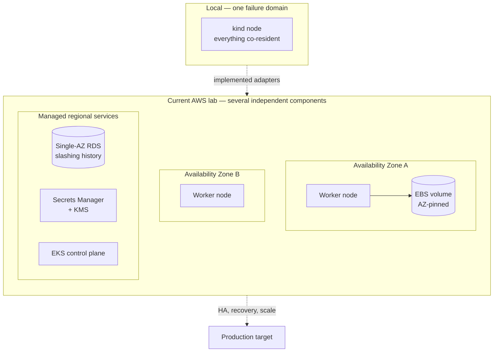

# Development environments and the production gap

This page compares the local `kind` profile, the applied AWS development lab,
and the remaining production requirements. It is not a second architecture
contract. Where this page and [the PRD](prd/001-dynamic-validator-platform.md)
disagree, the PRD is current.

The EKS/RDS/Secrets Manager environment is no longer proposed-only. On
2026-08-04 it ran two Ephemery client pairs and one active Web3Signer-backed
validator. That evidence is useful, but it does not convert the lab into a
production deployment. See
[the first signing record](evidence/2026-08-04-first-signing-validator.md).

## The core claim, stated precisely

Local qualification proves the **application and Kubernetes contracts**: Flux
reconciliation, reference-only secret consumption, chart behavior, and the
local PostgreSQL/Web3Signer interface.

The AWS lab separately proves selected **environment adapters**: EKS, EBS, Pod
Identity, Secrets Manager, private RDS, VPC CNI policy, zonal Spot capacity,
ACM/Route 53 ingress, and the live remote-signing path. It does not prove their
high-availability, recovery, scale, or long-duration behavior.

The substitutions are designed to terminate at stable contracts — StorageClass, SecretStore, PostgreSQL Service and credential Secret, workload labels, P2P Service — so the validator chart stays portable. That portability is the thing local work earns. It is not the same as durability, availability, or blast-radius control.

## Component substitution and what it does not carry over

| Capability | Local adapter | Current AWS lab | Remaining production gap |
|---|---|---|---|
| Kubernetes | `kind` containers | Amazon EKS 1.35 | Upgrade, API-throttling, access, and control-plane incident exercises |
| Persistent volumes | Local-path on the host | Encrypted EBS `gp3` via CSI, with zonal chain claims | Snapshot/restore timing, expansion under load, and recovery objectives |
| Slashing database | Single-instance CloudNativePG | Private encrypted Single-AZ RDS PostgreSQL 18.3 with seven-day backups | Multi-AZ failover, PITR, export/import, record continuity, and rejection drills |
| Secret source | Restricted namespace seeded from Git-ignored files | AWS Secrets Manager through scoped EKS Pod Identity and External Secrets | Rotation, revocation, key-policy review, and recovery exercises |
| P2P | Fixed `kind` port mappings | One selected pair uses one public NLB with combined TCP/UDP listeners, healthy Pod-IP targets, externally reachable TCP, and accepted bounded UDP probes; the other pairs use outbound peering | Valid Ethereum-protocol inbound peer attribution, 9001 UDP traffic, advertised-address behavior, stop/resume recreation, and DDoS posture |
| Capacity | Explicit Docker allocation | Separate on-demand system and zonal Spot Ethereum groups | Autoscaling and Spot interruption during active duties |
| Observability | Rules and dashboards via port-forward | Prometheus, Grafana, HTTPS status API, and public portal | Fleet cardinality, retention cost, alert routing, and long-duration reliability |
| Logging | Single-node Alloy/Loki profile | Not part of the current signing evidence | Durable backend, retention, backpressure, and fleet ingestion qualification |

Passing one layer does not establish the properties of the next layer.

## Failure domains

A single-node `kind` cluster has exactly one failure domain — the laptop. Everything either works or is gone, which means no local test can distinguish "survives partial failure" from "has never been partially failed."

Four consequences the local profile cannot surface, some of which the AWS lab
has now exposed directly:

1. **A pair instance is tied to its volume's Availability Zone.** EKS control-plane availability does not make an EBS-backed validator workload multi-AZ (PRD §8.6). Losing the AZ means restart time, not transparent failover, and the lab explicitly accepts that. Be precise about what is at stake: execution and consensus chain data is *regenerable* — PRD §14.1 classifies it as replaceable, recovered by resync with optional snapshots for speed — so the production question is recovery duration and duty downtime, not data loss. Resync, checkpoint sync, EBS snapshots, warm standby capacity, and replication are all legitimate points on that tradeoff curve. §8.6 asks that a production design model them explicitly and state correlated-failure limits; it does not prescribe replication as the answer.
2. **The slashing database is a separate failure domain.** RDS now runs outside EKS so the slashing record does not share the validator cluster's node and storage lifecycle (PRD §8.7). The first attestation exercised this path, but not its backup or failover behavior.
3. **Single-AZ RDS is a lab cost control, not a starting production posture.** Before any production claim, the database must be Multi-AZ or otherwise HA, and failover plus point-in-time restore must be exercised with signing disabled until record continuity is proven (PRD §8.7).
4. **Scale-to-zero validator capacity introduces a scheduling failure mode with no local analogue.** The live lab separates on-demand system nodes from zonal Spot Ethereum workers. A pause/resume path exists, but no autoscaler or active-duty Spot interruption has been qualified.

## Trust boundaries in the AWS lab

Locally there are two boundaries: the workstation/Git boundary and the cluster.
The AWS lab now implements three additional boundaries from PRD §7.3: AWS
management (IAM, Secrets Manager, RDS), the EKS platform (Flux, External
Secrets, Web3Signer), and validator workloads (EL/CL/validator client).

What this changes in practice:

- **Local secret seeding proves the consumer contract, not the producer.** External Secrets reading named secrets from a restricted bootstrap namespace demonstrates that manifests carry references rather than values. It is not evidence about IAM, KMS, or Secrets Manager (PRD §7.3), and the failure modes of the real producer — over-broad role policy, key policy drift, rotation breaking a running signer — are entirely untested locally.
- **Workload identity replaces local secret-source access.** The EKS environment uses Pod Identity and secret-scoped reader roles. Role chaining and transitive session tags were exercised during signer bootstrap; rotation and revocation remain open.
- **Network policy and filesystem isolation are different controls.** NetworkPolicy constrains network paths; it cannot protect a volume already mounted into a Pod. The signing keystore is projected only into Web3Signer, while the validator client receives the signer endpoint and public identity. VPC CNI allow/deny behavior has a public evidence record, but signer-specific negative-path and recovery exercises remain.

## The invariants do not change — their enforcement mechanism does

This is the distinction worth internalizing. None of the seventeen PRD §5 invariants get weaker, stricter, or renegotiated in production. What changes is what enforces them.

| Invariant | Local contract | Current AWS lab and remaining production work |
|---|---|---|
| 1 / 3 — one active assignment; break before make | Catalog validation rejects more than one live assignment for an identity | The same merge gate is active; ordered client-switch orchestration and runtime proof that the old client stopped remain open |
| 2 — one durable slashing authority | One CloudNativePG instance and signer | One Web3Signer and private RDS recorded the first duty; Multi-AZ, restore, and concurrency tests remain |
| 4 / 5 — no private key or mnemonic in Git | Reference-only manifests, schema/catalog validation, review, and Git-ignored local files | Secrets Manager and secret-scoped Pod Identity supply the encrypted keystore; withdrawal material remains offline |
| 6 — no key generation on Pod restart | `ExternalSecret` references a pre-existing secret; workloads contain no generation path | The same reference contract is live. Version rotation, recovery-copy, and absent-secret failure drills remain |
| 7 / 9 — readiness is not authorization | Desired-state gates and Lighthouse doppelganger configuration | The first activation manually verified sync, network identity, signer health, genesis identity, key uniqueness, and doppelganger completion before the first duty. Those observations are not yet one automated admission controller, and signer/database HA remains open |
| 8 — slashing history outlives workloads | Database survives Helm uninstall | RDS is outside the EKS workload lifecycle; backup restoration and record-continuity evidence remain |
| 12 — merge is deployment authorization | Flux, required checks, paired review, and exact-head merge validation | The public demo uses the same controls. A private operational repository and environment approvals are the production target |

The invariants that are cheapest to satisfy locally — 2, 6, 8 — are the ones whose production enforcement is most complex. That inversion is worth watching: local ease is not a signal of production simplicity.

## Observability: the change is volume, not design

Telemetry contracts deliberately do not fork by environment (PRD §8.1) — the same Prometheus rules and Grafana dashboards are intended to work in both. What changes is scale, and scale surfaces cost.

- **Label cardinality is the main lever.** Per-validator views should use recorded aggregates and targeted queries rather than adding public-key labels to every infrastructure metric (PRD §12.7). The current AWS lab has two active pair assignments and one signing validator; `pod`, `validator_id`, and `assignment_id` are the labels that grow with a fleet. Their cost must be evaluated against the target scale, not the current sample.
- **Retention numbers sized for a laptop are not proposals.** Local bounds exist to protect a workstation disk. Production retention is a cost and compliance decision to be made after observing real ingestion volume (PRD §12.7).
- **Observability storage must never compete with validator data on the same PVC** (PRD §12.7) — trivially true locally, an explicit provisioning decision in production.
- **Metrics and logs are the one state class that is replaceable** (PRD §14.1). They should not be protected as if they were slashing history.

## Threat model deltas

The threats in PRD §13.4 apply in both environments. Three change materially in production:

| Threat | What is different once deployed |
|---|---|
| Key exfiltration from a validator pod | The AWS lab exercises remote signing, signing-namespace-only key projection, service-account separation, secret-scoped IAM, and VPC CNI policy. It has not completed adversarial Pod-compromise, credential-rotation, or signer-recovery exercises. |
| Loss of EKS or EBS | Locally this is "recreate the cluster." In production, recovery ordering matters: prove key access, restore and validate slashing history, *then* rebuild, resync, and re-gate before any signature (PRD §14.2). |
| Signer/database outage | Fail-closed behavior is identical, but the recovery objective is not: near-zero data loss for slashing history, and no signing after uncertain recovery (PRD §14.3). |

Two threats are met by the same architecture in both environments, though not yet to the same depth — and it is worth being exact about which legs exist.

Double-signing during migration rests on four controls. **Uniqueness is a catalog-level policy, defined and machine-checked**: `tools/validate_catalog.py` rejects any catalog in which one identity holds more than one live assignment, and CI runs it on every pull request. **The shared slashing database is real and recorded the first duty.** **Break-before-make is a state model, not an orchestration** — `switching` counts as live, but nothing yet automates teardown of the old assignment or proves at runtime that it stopped. **Doppelganger protection completed successfully for the first activation**, but client-migration reuse has not been exercised. The catalog policy and first-duty gate are implemented; migration orchestration is not.

Secret leakage into Git is prevented identically in both environments by reference-only manifests, schema and catalog validation, and review.

## What must be exercised before any production claim

Derived from PRD §8.7, §14.2, and §17. The AWS lab has exercised parts of
items 4, 8, and 9, but none is complete as a production qualification:

1. RDS Multi-AZ (or equivalent HA), with failover exercised and record continuity proven, signing disabled throughout.
2. Point-in-time restore drill verifying Web3Signer compatibility — a successful database restore is not sufficient until a safe signing/rejection test passes.
3. Slashing-history export/restore proven before any cluster holding a funded key is deleted.
4. Repeatable workload-identity qualification per responsibility, including attempted over-reach, rotation, and revocation.
5. Autoscaler behavior under active duties, including proof that validator scale-down cannot evict system-pool safety services.
6. Advertised-vs-reachable P2P port parity through the real NLB path.
7. Measured RPO/RTO replacing the proposed lab targets in PRD §14.3.
8. Convert the manually exercised first-activation checks—sync, network/genesis identity, signer health, uniqueness, and runtime doppelganger—into a repeatable admission and evidence workflow.
9. Extend the existing VPC CNI allow/deny evidence to signer-specific paths, recovery states, and policy regression tests. The local default CNI still does not enforce NetworkPolicy.

## How to use this page

For any claim, identify which environment supplied the evidence and compare it
with the final column of the substitution table. Do not infer an availability,
recovery, or scale property from an adapter that was only shown to function.

---

*Related: [PRD §8](prd/001-dynamic-validator-platform.md) (deployment environments), [§13](prd/001-dynamic-validator-platform.md) (security and policy), [§14](prd/001-dynamic-validator-platform.md) (backup and recovery), [§15](prd/001-dynamic-validator-platform.md) (scale path), and [ADR 0001](adrs/0001-local-first-kind.md) (local-first `kind`).*
