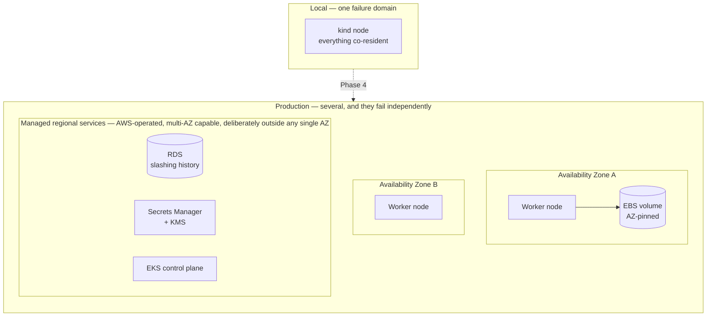

# Local qualification → production: what actually changes

This page exists to prevent one specific mistake: reading a green local cluster as evidence that the platform is production-ready. It is not a plan and not a second architecture contract — it is a reading of [the PRD](prd/001-dynamic-validator-platform.md) that makes the local/production gap explicit in one place. Where this page and the PRD disagree, the PRD is current.

Scope: the transition from the local `kind` environment (PRD §8.1) to the proposed EKS/RDS/KMS/Secrets Manager deployment (PRD §8.2, Phase 4).

## The core claim, stated precisely

Local qualification proves the **application and Kubernetes contracts**: that Flux reconciles the desired state, that External Secrets resolves references without secret values entering Git, that Web3Signer owns a durable slashing record in PostgreSQL, that the chart renders safely across profiles, and that a healthy pod does not imply signing authorization.

Local qualification proves **nothing** about the infrastructure underneath those contracts. `kind` is not EKS, local-path is not EBS, and CloudNativePG on one node is not RDS. PRD §8.1 states this directly: the local overlay does not emulate EBS, IAM, KMS, RDS, VPC routing, Availability Zones, NLB behavior, or Karpenter.

The substitutions are designed to terminate at stable contracts — StorageClass, SecretStore, PostgreSQL Service and credential Secret, workload labels, P2P Service — so the validator chart stays portable. That portability is the thing local work earns. It is not the same as durability, availability, or blast-radius control.

## Component substitution and what it does not carry over

| Capability | Local adapter | Production adapter | What the local proof does **not** establish |
|---|---|---|---|
| Kubernetes | `kind` containers | Amazon EKS | Control-plane availability, API throttling, upgrade behavior, node lifecycle |
| Persistent volumes | Local-path on the host | Encrypted EBS `gp3` via CSI | AZ-pinning of volumes, expansion behavior, snapshot timing, IOPS under sync load |
| Slashing database | Single-instance CloudNativePG | Amazon RDS PostgreSQL | Failover, point-in-time recovery, backup restoration, record continuity across failover |
| Secret source | Restricted namespace seeded from Git-ignored files | AWS Secrets Manager via workload identity | IAM policy correctness, KMS key handling, credential rotation, role scoping |
| P2P ingress | Fixed `kind` port mappings | NLB / security-group path | Real inbound peering, advertised-vs-reachable port parity, DDoS exposure |
| Capacity | Explicit Docker allocation, one pair | System pool + scale-to-zero validator pool | Autoscaler behavior, instance-type selection, scale-down safety during duties |
| Observability | Same rules/dashboards via port-forward | Same rules/dashboards, managed evaluation later | Ingestion volume at fleet scale, retention cost, query performance |
| Log storage | Loki `SingleBinary`, filesystem chunks on one 5 GiB PVC, 24-hour compactor retention | Object storage or a managed log backend | Durability of a single-replica filesystem store, multi-AZ behavior, ingestion limits, retention cost |
| Log collection | Alloy DaemonSet reading Pod logs through the Kubernetes API, scoped to its own node | Same collector, fleet-sized | Collector resource cost per node, API read pressure at scale, backpressure when the backend is slow |

The rule of thumb: **the contract is portable, the failure behavior is not.**

## Failure domains that do not exist on a laptop

A single-node `kind` cluster has exactly one failure domain — the laptop. Everything either works or is gone, which means no local test can distinguish "survives partial failure" from "has never been partially failed."

Four consequences the PRD calls out, none of which local testing can surface:

1. **A pair instance is tied to its volume's Availability Zone.** EKS control-plane availability does not make an EBS-backed validator workload multi-AZ (PRD §8.6). Losing the AZ means restart time, not transparent failover, and the lab explicitly accepts that. Be precise about what is at stake: execution and consensus chain data is *regenerable* — PRD §14.1 classifies it as replaceable, recovered by resync with optional snapshots for speed — so the production question is recovery duration and duty downtime, not data loss. Resync, checkpoint sync, EBS snapshots, warm standby capacity, and replication are all legitimate points on that tradeoff curve. §8.6 asks that a production design model them explicitly and state correlated-failure limits; it does not prescribe replication as the answer.
2. **The slashing database becomes a separate failure domain, deliberately.** RDS lives outside EKS specifically so the safety-critical slashing record does not share a cluster, node, storage layer, and operational control plane with the validator clients (PRD §8.7). This is the single most important structural change between local and production, and it is the one that local CloudNativePG most resembles on the surface while sharing none of its properties.
3. **Single-AZ RDS is a lab cost control, not a starting production posture.** Before any production claim, the database must be Multi-AZ or otherwise HA, and failover plus point-in-time restore must be exercised with signing disabled until record continuity is proven (PRD §8.7).
4. **Scale-to-zero validator capacity introduces a scheduling failure mode with no local analogue.** The system pool must stay available so reconciliation and safety services survive validator scale-down (PRD §8.3). A misconfigured autoscaler that evicts the signer is a fail-closed event locally and an outage in production.

## Trust boundaries shift, and one new one appears

Locally there are two boundaries: the workstation/Git boundary and the cluster. Production splits the cluster boundary in three (PRD §7.3) — an AWS management boundary (IAM, Secrets Manager, RDS), an EKS platform boundary (Flux, External Secrets, Web3Signer), and a validator workload boundary (EL/CL/validator client).

What this changes in practice:

- **Local secret seeding proves the consumer contract, not the producer.** External Secrets reading named secrets from a restricted bootstrap namespace demonstrates that manifests carry references rather than values. It is not evidence about IAM, KMS, or Secrets Manager (PRD §7.3), and the failure modes of the real producer — over-broad role policy, key policy drift, rotation breaking a running signer — are entirely untested locally.
- **Workload identity replaces "everything in one namespace."** Production requires EKS Pod Identity or IRSA with one role per responsibility (PRD §13.1). There is no local equivalent to get wrong, which means there is also no local test that catches getting it wrong.
- **Network policy and filesystem isolation are different controls, and it is not NetworkPolicy that protects the keystore.** NetworkPolicy constrains network paths. It cannot stop a compromised process from reading a volume already projected into its own pod, and the validator client is *supposed* to reach the signer API — that path is the design, not a leak. What protects signer material is that the keystore is projected only into the signing namespace, plus pod isolation, service-account and RBAC separation, and runtime identity. NetworkPolicy's job is the narrower one of keeping everything else off the signer, database, and metrics paths (PRD §13.2). Locally it is also only *declared*: the default `kind` CNI does not implement NetworkPolicy, so the manifests are validated but their runtime behavior is not exercised at all.

## Repository visibility and the Git-source credential

This repository is public as a portfolio and disclosure choice, not because a production operator repository would be. A production instance would be private, and — more importantly — the cluster would not authenticate to Git at all. The production shape moves the reconciliation source from Git to a signed OCI artifact in ECR, and the cluster-edge credential from a static Git secret to a short-lived AWS role assumed via EKS Pod Identity.

The two shapes side by side:

| Concern | This demo | Production target |
|---|---|---|
| Repository visibility | Public, audited free of keys, personal identifiers, company references, and load-bearing operational strings | Private, with the same content hygiene held as a precondition rather than a demonstration |
| What the cluster reconciles from | The Git repository directly, over SSH | An `OCIRepository` in ECR, containing rendered, validated, and cosign-signed manifests published by CI |
| Cluster-edge credential | A read-only ECDSA deploy key created once from a trusted workstation, private half held in the EKS `flux-system` Secret; documented in [eks-flux-bootstrap.md §4](runbooks/eks-flux-bootstrap.md) | A short-lived AWS role assumed by the Flux `source-controller` Pod through EKS Pod Identity. No Git credential lives in the cluster at all |
| Where the private-repo credential does live | N/A — repo is public | The same-repository GitHub Actions job reads the private repository through its ephemeral, per-job `GITHUB_TOKEN`, which GitHub scopes to that repository and expires when the job ends — no separate GitHub App is required for checkout or triggering. To publish, the workflow assumes a narrowly scoped AWS IAM role via GitHub OIDC federation and pushes to ECR under that role. A separate GitHub App only enters the picture if there is a concrete cross-repository or API permission it needs to supply; there is none in this shape. No Git credential enters the cluster |
| Provenance gate on reconciliation | Reconciles whatever is on `main` at fetch time, subject to the merge-time controls (CODEOWNERS, required checks, review) | Flux verifies the cosign signature on the OCI artifact against a pinned accepted-signer identity — keyless GitHub-OIDC signing paired with Flux's `verify.matchOIDCIdentity` pinning the signer's subject (the specific workflow file + ref) and issuer. An artifact signed by any identity other than the accepted one fails closed. Cosign proves *who* signed the artifact and that its contents were not modified after signing; it does not prove the artifact is benign if the accepted signer itself is compromised |
| Bootstrap ordering | The Flux `GitRepository` uses SSH with a `secretRef` at the read-only deploy key Secret, which the operator creates once during bootstrap before any Kustomization reconciles. Because the repository is public, an anonymous-HTTPS `GitRepository` would also work as a bootstrap simplification, but that is not the current implementation | The cluster only needs to assume its Pod Identity role and reach ECR. No manual key-seeding step; no bootstrap circularity between External Secrets and its own Git source |
| Credential rotation | Delete and regenerate the deploy key; re-run the bootstrap runbook | Rotate the trust conditions or permissions on the CI-assumed AWS role in place; the cluster's Git-source credential does not exist to rotate, and the CI-side credential is the ephemeral `GITHUB_TOKEN` that GitHub already rotates per job |
| Blast radius on credential compromise | Read-only access to one public repository whose content is already publicly disclosed | Compromise of the cluster's Pod Identity role gives read on signed OCI artifacts in ECR — not Git history, not write on manifests. Compromise of the CI workflow's assumed AWS role gives ECR write under a scoped, revocable identity; Flux's `matchOIDCIdentity` still gates what the cluster reconciles, so an unauthorized signer's artifact fails closed. A compromised *authorized* signer can produce a valid signature, which is why the CI role's trust conditions (repo, ref, environment), GitHub environment protection, and provenance-metadata review still matter |
| Approval and merge policy | Two-agent cross-review with the fail-closed `hack/merge-pr.sh` wrapper | The same wrapper, plus branch protection with required human approvers on protected paths (Terraform, cluster manifests, signing configuration) |

**Why the production target moves the trust boundary this far rather than stopping at "GitHub App for Flux too."** Swapping the deploy key for a GitHub App is a strict improvement — repo-scoped, permission-scoped, short-lived installation tokens per fetch, revocable in one click — but it still requires a long-lived App private key that the cluster (or something the cluster reaches) has to hold and rotate. Splitting reconciliation so that **the cluster holds only an AWS role** and Git access lives entirely in CI removes that credential from the cluster edge. It also introduces cosign verification as a provenance gate: an artifact signed by any identity other than the accepted signer fails Flux verification and is not reconciled. That does not make the pipeline immune to a compromised accepted signer (a compromised authorized signer produces a valid signature), which is why the CI-role trust conditions, GitHub environment protection on the AWS-role assumption, and review of the pinned signer identity all matter — but it does close the "quietly reconcile something from an untrusted publisher" failure mode that a passive Flux would otherwise be exposed to.

**One structural fact that shapes both choices:** there is no OIDC federation *into* GitHub. GitHub *issues* OIDC tokens — a GitHub Actions job can present one to AWS STS to assume an IAM role, which is how the production target authenticates the CI publisher — but GitHub does not accept OIDC tokens for calls into its own API. A truly credential-free path from an EKS workload to a GitHub repository does not exist today. The production target routes around that by making the cluster's reconciliation source AWS-native (ECR + Pod Identity) rather than trying to authenticate the cluster to GitHub with something better than a static credential. (This repository's current CI does not yet assume any AWS role; the OIDC-to-AWS trust is part of the migration below, not present state.)

**The migration is a follow-up, not on the visibility critical path today.** It requires: an ECR repository with a lifecycle policy for the manifest artifact; an AWS IAM role trusted by GitHub OIDC, assumable only by the specific repository, ref, and environment that publishes the artifact, with `ecr:*` scoped to that repository; a GitHub Actions workflow that renders, validates, keyless-cosign-signs (via its OIDC identity), and pushes the artifact under the assumed AWS role; an EKS Pod Identity association for `flux-system` with an IAM role granting `ecr:GetAuthorizationToken` and read on the artifact repository; and a Flux `OCIRepository` resource with `verify.provider: cosign` plus `verify.matchOIDCIdentity` pinning the accepted GitHub workflow identity (subject and issuer). Each is a normal, well-supported control; the aggregate is what removes the "cluster has to hold a Git credential" problem.

## The invariants do not change — their enforcement mechanism does

This is the distinction worth internalizing. None of the seventeen PRD §5 invariants get weaker, stricter, or renegotiated in production. What changes is what enforces them.

| Invariant | Enforced locally by | Enforced in production by |
|---|---|---|
| 1 / 3 — one active assignment; break before make | **Catalog-level policy, machine-checked.** Validation rejects any catalog in which one identity holds more than one live assignment, run in CI on every PR. Runtime binding is absent: the ordered switch is not orchestrated and no runtime check confirms the old client stopped | The same merge-time gate, plus the client-switch orchestration and runtime doppelganger qualification that Phase 5 adds |
| 2 — one durable slashing authority | One CloudNativePG instance, one signer | RDS with backups and PITR; HA before any production claim |
| 4 / 5 — no private key or mnemonic in Git | Reference-only manifest design, JSON Schema and relational catalog validation in CI, code review, and `.gitignore` plus workstation discipline for local secret files | The same repository controls, with Secrets Manager + KMS + IAM policy as the secret source; withdrawal material stays offline |
| 6 — no key generation on pod restart | An `ExternalSecret` reference to a pre-existing secret. The workload contains no generation path, and it fails when the identity is absent rather than creating one | The same reference contract, with Secrets Manager versioning and a documented encrypted recovery copy behind it |
| 7 / 9 — readiness is not authorization; fail closed | **Partial today.** Schema-enforced desired state: `signingEnabled: true` requires `lifecycle: active`, a `nodePairRef`, and `slashingProtectionConfirmed` / `doppelgangerProtectionConfirmed`, plus the Lighthouse `--enable-doppelganger-protection` flag. Those confirmations are *self-attested fields*, not runtime checks | The same declarative gates, plus the runtime qualification that is still planned — sync distance, clock health, network identity, signer health, uniqueness, and runtime doppelganger — and signer/database HA across AZs |
| 8 — slashing history outlives workloads | Database survives Helm uninstall | Database is in a different service, VPC path, and failure domain entirely |
| 12 — merge is deployment authorization | Flux reconciliation from the repository, with branch protection, required status checks, CODEOWNERS review, and linear history already enabled on `main`. This demo repository is public; a production instance would be private, and the Git-source credential path changes as described above | The same controls, plus environment approval for sensitive workflows |

The invariants that are cheapest to satisfy locally — 2, 6, 8 — are the ones whose production enforcement is most complex. That inversion is worth watching: local ease is not a signal of production simplicity.

## Observability: the change is volume, not design

Telemetry contracts deliberately do not fork by environment (PRD §8.1) — the same Prometheus rules and Grafana dashboards are intended to work in both. What changes is scale, and scale surfaces cost.

- **Label cardinality is the main lever, and it is already worth watching.** Per-validator views should use recorded aggregates and targeted queries rather than duplicating public-key labels across every infrastructure metric (PRD §12.7). The same reasoning applies to log streams, and the shipped local configuration is a concrete instance: Alloy promotes fourteen labels onto every stream — `namespace`, `pod`, `container`, `node`, `app`, `job`, `network`, `customer_id`, `validator_id`, `assignment_id`, `execution_client`, `consensus_client`, `component`, `lifecycle_state` — plus three fixed ones. Most are low-cardinality today because the fleet is one stopped pair, and `pod` and the per-validator/per-assignment identifiers are the ones that grow with it. This costs nothing at lab scale and is exactly the kind of choice that is expensive to walk back later, so the label set is worth deciding against the intended fleet size rather than against what is comfortable now.
- **Retention numbers sized for a laptop are not proposals.** Local bounds exist to protect a workstation disk. Production retention is a cost and compliance decision to be made after observing real ingestion volume (PRD §12.7).
- **Observability storage must never compete with validator data on the same PVC** (PRD §12.7) — trivially true locally, an explicit provisioning decision in production.
- **Metrics and logs are the one state class that is replaceable** (PRD §14.1). They should not be protected as if they were slashing history.

## Threat model deltas

The threats in PRD §13.4 apply in both environments. Three change materially in production:

| Threat | What is different once deployed |
|---|---|
| Key exfiltration from a validator pod | The blast radius becomes real. Remote-signer architecture, secret projection scoped to the signing namespace, service-account/RBAC separation, no secret-bearing IAM on workload roles, and NetworkPolicy all have to hold at once. Locally their *manifests and contracts* are tested; their *runtime enforcement* largely is not — the default `kind` CNI does not enforce NetworkPolicy, and there is no local IAM to misconfigure. |
| Loss of EKS or EBS | Locally this is "recreate the cluster." In production, recovery ordering matters: prove key access, restore and validate slashing history, *then* rebuild, resync, and re-gate before any signature (PRD §14.2). |
| Signer/database outage | Fail-closed behavior is identical, but the recovery objective is not: near-zero data loss for slashing history, and no signing after uncertain recovery (PRD §14.3). |

Two threats are met by the same architecture in both environments, though not yet to the same depth — and it is worth being exact about which legs exist.

Double-signing during migration rests on four controls. **Uniqueness is a catalog-level policy, defined and machine-checked**: `tools/validate_catalog.py` rejects any catalog in which one identity holds more than one live assignment, and CI runs it on every pull request. **The shared slashing database is real and running.** **Break-before-make is a state model, not an orchestration** — `switching` exists as a lifecycle value and counts as live, but nothing automates tearing down the old assignment before the new one starts, and nothing verifies at runtime that the old client actually stopped; client-switch automation is Phase 5 work. **Doppelganger protection** is a self-attested field plus a client flag, with the runtime-qualified check still planned. So the catalog-level policy for this threat is defined and machine-checked, while the runtime binding and orchestration that would enforce it during an actual switch are not built — the catalog is not yet wired to a switch controller.

Secret leakage into Git is prevented identically in both environments by reference-only manifests, schema and catalog validation, and review.

## What must be exercised before any production claim

Derived from PRD §8.7, §14.2, and §17. None of these is satisfied by the local evidence that exists today:

1. RDS Multi-AZ (or equivalent HA), with failover exercised and record continuity proven, signing disabled throughout.
2. Point-in-time restore drill verifying Web3Signer compatibility — a successful database restore is not sufficient until a safe signing/rejection test passes.
3. Slashing-history export/restore proven before any cluster holding a funded key is deleted.
4. Workload identity (Pod Identity/IRSA) verified per responsibility, with scoping confirmed by attempted over-reach rather than by reading policy.
5. Autoscaler behavior under active duties, including proof that validator scale-down cannot evict system-pool safety services.
6. Advertised-vs-reachable P2P port parity through the real NLB path.
7. Measured RPO/RTO replacing the proposed lab targets in PRD §14.3.
8. The runtime activation gates built and exercised — sync distance, clock health, network identity, signer health, uniqueness, and runtime doppelganger — replacing today's self-attested confirmations. Much of this is buildable locally; what is not is qualifying it against AZ-spanning clock and network conditions.
9. NetworkPolicy enforcement verified under a policy-enforcing CNI. The local default CNI does not implement NetworkPolicy, so today the policies are validated as manifests and have never been observed to block anything.

## How to use this page

When a local result looks like production evidence, find the capability in the substitution table and read the last column. If the property you are about to claim lives in that column, the local run did not test it.

---

*Related: [PRD §8](prd/001-dynamic-validator-platform.md) (deployment environments), [§13](prd/001-dynamic-validator-platform.md) (security and policy), [§14](prd/001-dynamic-validator-platform.md) (backup and recovery), [§15](prd/001-dynamic-validator-platform.md) (scale path), and [ADR 0001](adrs/0001-local-first-kind.md) (local-first `kind`).*
